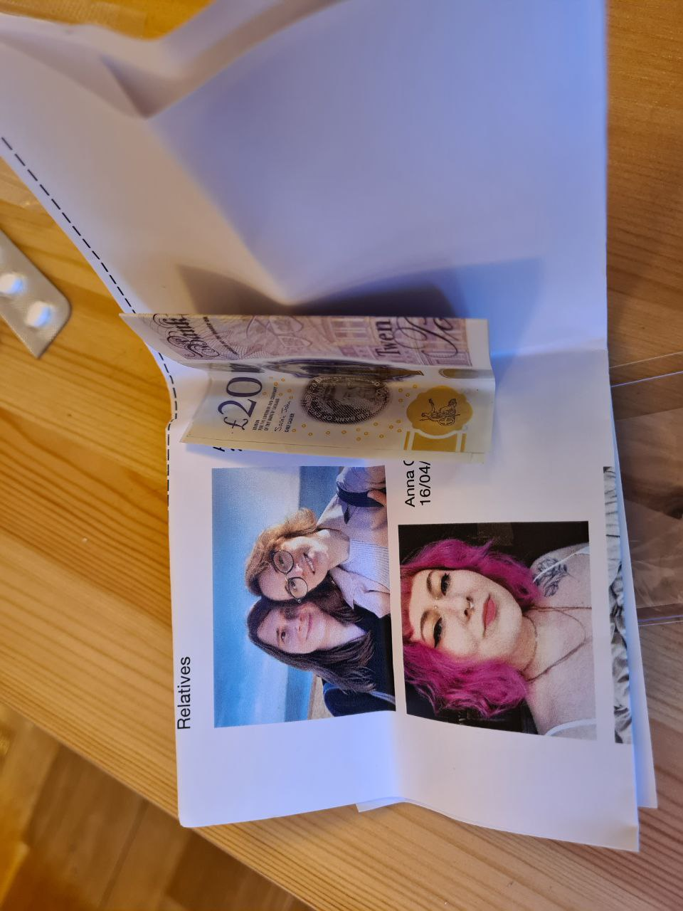

# Emergency kit Mk 2

Disclaimer: this is an unsponsored article. I am building my kit as I see fit; external links are added for reference purposes, as I don't have good photos of some items.

## Overview

I have been concerned about personal safety and preparedness since my teenage years. Still, in the past, I have always been relying on someone else's skills and equipment to get me out of trouble. This year I realised I am meant to be a responsible adult, and I should have some sort of an emergency kit.

My first attempt at building an emergency kit was, I have to admit, pathetic. I ended up with a huge backpack full of heavy useless rubbish that, at best, could be used for camping. It took some time and experience to try out the gear, reassess the risks and threats, and rebuild the emergency kit.

This emergency kit is highly personal and is meant as a measure against threats that I either faced in the past or consider a possibility in the nearest future. If you think I am missing something important, please let me know.

The kit has two parts. The red bag is meant to be carried with me at all times. Except when I go outside the flat to throw out the rubbish. The grey bag is bulkier and heavier, and it's for day trips or situations when I need to leave my flat quickly with my cat in my arms.

A 13" laptop, an SD card and a ruler for scale.

The red bag weighs 588 grams (1.3 pounds).

The grey bag weighs 1.193 kg (2.6 pounds), so the total weight of the kit is about 1.8 kilo (under 4 pounds).

## Red Kit, aka "Get home safely" kit

The red kit is mostly a medkit on steroids. It is meant to help with minor wounds, first and foremost. You can see an emergency whistle and a CPR face shield attached to the zipper. An emergency whistle is a really great tool that can help you to get attention to your situation, for example, if you tripped and fell somewhere and there aren't many people around.

This is the full kit. I will show you its parts closer.

There's a complete nutrition bar (yummy!), an emergency blanket (versatile), and a tube of sterile eyewash (salty water, basically). A small round thing is a spare water filter for the grey kit.

There's a pencil and some waterproof paper (for leaving notes), a face mask (just in case), a couple of large self-sticking bandages (for big cuts), and a half-decent flashlight (AAA powered).

There's nitrile gloves (sometimes I need to touch gross stuff!), alcohol wipes (double down as fire starters), water-proof matches, and a peppy pocket knife (two blades, scissors and screwdriver).

This thing is an AM/FM radio powered by two AAA batteries. In a situation like London bombings, when transport is paralyzed and mobile networks are overwhelmed, being able to tune in to a radio station can save lives. Batteries can be used as spares for the flashlight, and cheap earphones can be used as wire if situation is desperate.

Here is the medical part of the medkit. My regular meds (2x20 BL!), plus allergy pills, painkillers and Gaviscon. Water treatment tablets (for 12 liters). Band-aids and blister band-aids. Gauze and adhesive tape. Vacuum-packed paper towels. Riot Medicine manual on First Aid. Two zip-locks that can be used as a canteen or water-tight storage.

Copy of important documents, medical record summary, photos and contact information of friends and family. £30 in cash. A plastic lens.

## Grey kit, aka "(Get) lost" kit

This part of the kit is bulkier and heavier, but still compact enough to be carried around without much effort. It is intended for day trips to the local woods going awry, or for sudden evacuations. Having such a kit (hopefully) can make a difference in "there was a fire, and you have no home now" situations at first.

This is everything you can find inside. A pack of tissues. A USB-powered hand-warmers/powerbanks (warm and comfy!). 5 meters of sturdy cord for making a tent or fixing something. A 24 hour supply of cat food. A tiny 18L backpack. A titanium knife, as the pocket knife alone doesn't look sturdy enough to prepare the firewood. A water filter straw for drinking from dubious water sources. A proper 1.5L water bottle (empty; fill it with water you can find and use water treatment pills). Extra water treatment pills. Sanitizer (when there's no soap). Two extra emergency blankets (they are extremely useful for many situations, from building a shelter to having a picnic). An air mattress with R-value of 4.2 and repair kit. A bivvy bag.  

A bivvy bag is basically a tent made out of emergency blankets. It's a good shelter from wind and rain, and you probably would not die in it if you were to sleep in it at usual UK weather, but it won't be warm or comfortable enough alone. [Amazon link](https://www.amazon.co.uk/HONYAO-Survival-Sleeping-Emergency-Reusable/dp/B09GM8XJ3M?th=1)

The first air mattress I ever bought had an R-value of about 0. I tried to use it for early spring camping, and deeply regretted this decision. This air mattress, while being tiny and lightweight, boasts R-value of 4.2, which should give enough shielding from the ground on an average autumn night. I am yet to try it out, though. [Ultralight shop link](https://ultralightoutdoorgear.co.uk/neoair-xlite-small-sleeping-mat/)

This is the tiny 18L backpack in its true form, sturdy and comfortable to carry. On the photo, I carry all the other equipment inside of it, and there's plenty of room for more stuff to put inside.

