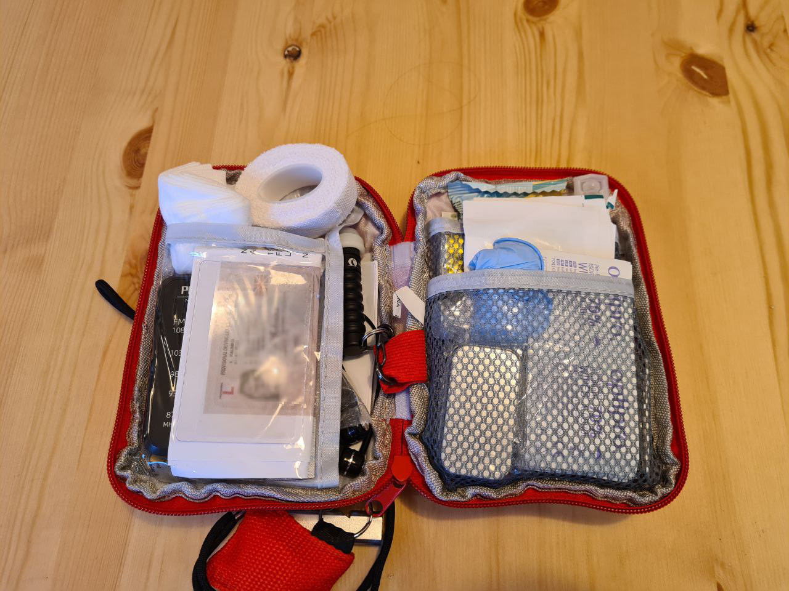

* Emergency kit Mk 2

I have been concerned about personal safety and preparedness since my teenage years. Still, in the past, I have always been relying on someone else's skills and equipment to get me out of trouble. This year I realised I am meant to be a responsible adult, and I should have some sort of an emergency kit.

My first attempt at building an emergency kit was, I have to admit, pathetic. I ended up with a huge backpack full of heavy useless rubbish that, at best, could be used for camping. It took some time and experience to try out the gear, reassess the risks and threats, and rebuild the emergency kit.

This emergency kit is highly personal and is meant as a measure against threats that I either faced in the past or consider a possibility in the nearest future. If you think I am missing something important, please let me know.

The kit has two parts. The red bag is meant to be carried with me at all times. Except when I go outside the flat to throw out the rubbish. The grey bag is bulkier and heavier, and it's for day trips or situations when I need to leave my flat quickly with my cat under my shoulder.

A 13" laptop, an SD card and a ruler for scale.

The red bag weighs 588 grams (1.3 pounds).

The grey bag weighs 1.193 kg (2.6 pounds), so the total weight of the kit is about 1.8 kilo (under 4 pounds).

** 

