## In-tenˊtion-al′i-ty
**2025-07-12**
[Originaly posted on Mastodon](https://tech.lgbt/@nina_kali_nina/114841106370969188)

In-tenˊtion-al′i-ty
(n.) The quality or state of being intentional; purpose; design.

This spring, at the ripe age of 33, I started drawing. One of my primary goals was to create graphics for my little games. At this point, after about 200 hours of practice, I think I am pretty close to being able to draw anything I want. Especially in the context of retro game dev and pixel art.

If you haven't seen yet my notes on the first 40 hours of drawing, here is the link: https://www.ninakalinina.com/notes/iseeidraw/

In this log, I want to talk about two major topics: the progress I've made since the note and the importance of intention in character design. Incidentally, I will share my thoughts on why GenAI art will always be mediocre at best.

As an eye trap, here's a character I've finished a month ago (and I've improved since)

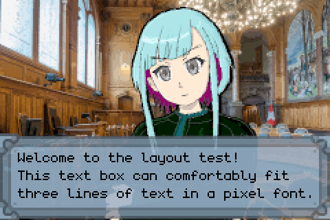

I'll start with the simplest of the two: my art progress since March.

I only share somewhat complete illustrations here. There were many practice drawings in between. My understanding of proportions, line art, colours, rendering and anatomy has improved substantially. I also have much better control over my brushes in Krita. As it happens, drawing digitally is a skill quite different from drawing in pencil!

I know I should work more on practice assignments to improve my drawing, but it feels a bit boring, so I try to draw original art or learn by copying the masters.

An incredible thing about improved drawing skills: now I see dozens of mistakes on each of the drawings in this post. For this reason, I'm not super-eager on drawing actual illustrations for actual games just yet. I feel like I might not be able to get a consistent art style, or will be stuck in a cycle of redraws.

Worse still, in the last few days I have realised some scary things about _character design_.

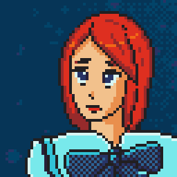
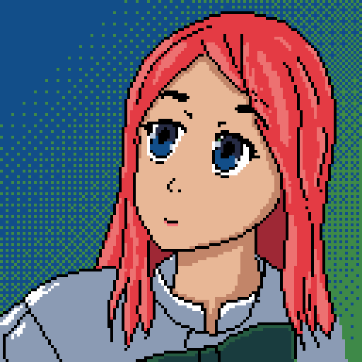
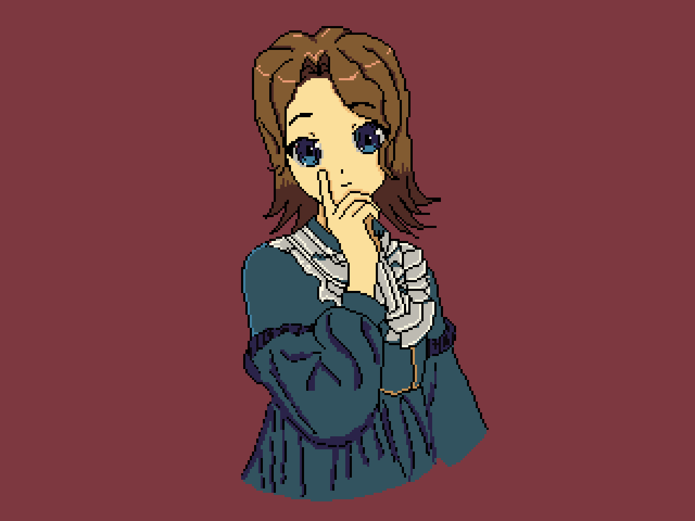

Side note: when you see a completed illustration, do not expect the artist to ALWAYS produce incredible art, especially in the early sketch stage. Some artists, especially experienced ones, do. Beginners like me start with coals and try to polish them into diamonds.

For example, these two sketches are only a couple of hours apart. Please don't be too harsh on them. I was not trying to produce an illustration or concept art. I just used drawing to THINK.

Yes, you read that right. I am now using my pencil to think about character design in ways I have never thought of before.

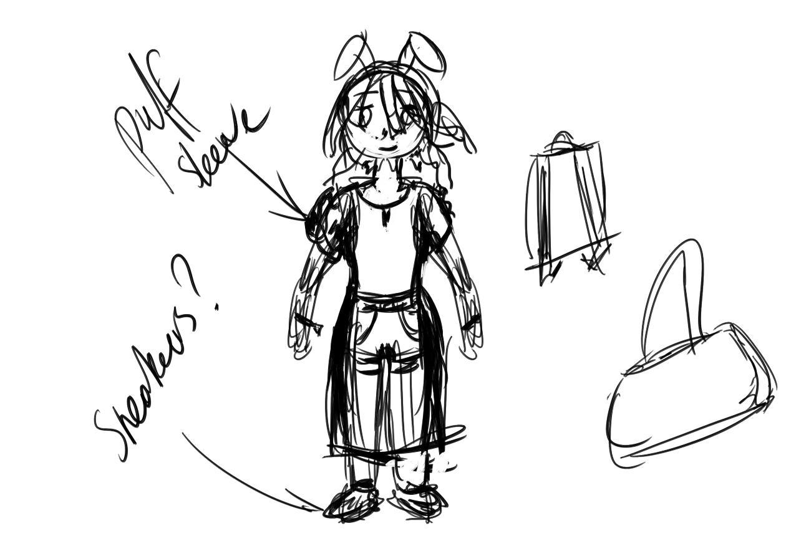

Over the last few days, engrossed in character design, I became convinced that GenAI illustrations are going to stay mediocre. Not because I've been using GenAI image generators (I do not intend to, and please do not use them to try and prove me wrong, okay?), but because I realised that good character design requires intentionality.

The most important character in the game I'm making is a "revolutionary bunny girl". There are story reasons why she is a rebel, and there are reasons why she has to be a bunny girl, too.

When I worked with artists before, on this step I'd create a very rough character sheet, give it to the artist, and hope that the artist will design a convincing character. Sometimes it worked right away, sometimes it didn't, and we had to iterate over multiple designs.

I'm sure that if I asked text-to-image model, it could generate a stunning illustration of a "sporty bold rebel bunny girl with pink hair wearing green and violet special ops uniform". The problem is...

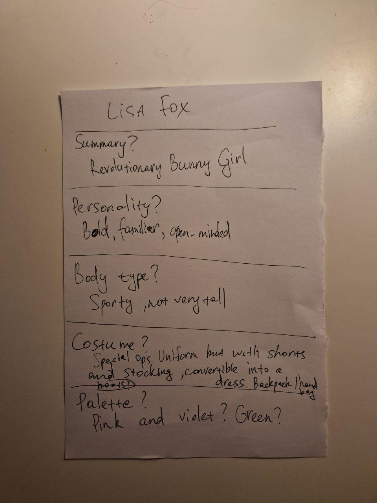

When the description is non-specific, you can draw a generic character, and it will fit the bill. For the character I'm trying to design, look: bunny ears, green shorts, donezo-bananza. If the image looks polished, and the character is posed in some interesting pose ("Wanna fight, punk?!"), it will be very hard for you to accept that the design is mediocre and the character lacks memorableness. This is the worst thing you can do to your game's main character. If she existed, she'd hate you for this.

I'm super lucky I started with ugly scribbles for the costume and character design because it was easier for me to accept that the design should be thrown into the bin.

I kept iterating and iterating on parts of the design even after I realised I am missing an important point needed to design this character.

Looking again at the drawings, I can say with certainty: I'm so lucky I didn't try to use this character design to make a complete illustration.

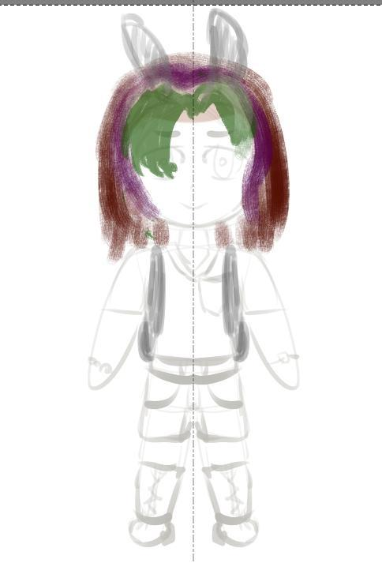
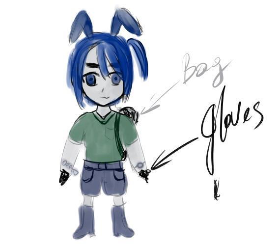

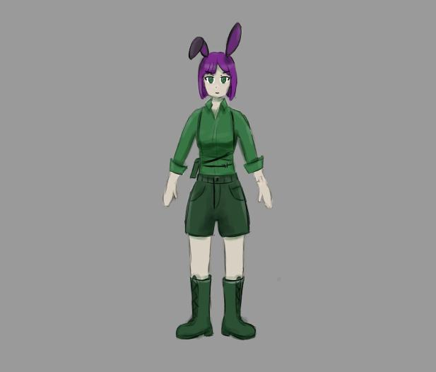

Okay, so, the character design itself is lacking. But what exactly is missing?

... And so, I've spent a few hours in the last few days research revolutionaries and rebels, especially in the context of pop art and video games. It seems, there are generally two types of rebels: those who work from the shadows, and those who are working on their image so they're basically public figures.

Jessie from FF7? Shadows. Celes from FF6? Politician. Persona 5 cast? Shadows. Goro Akechi? Politician.

It works even if it is the same person! Lelouch? Working from shadows. Zero? Politician. (Counter-intuitively!)

There does not seem to be an outfit feature associated with rebels except for military outfits for men and excessive nudity for women in Square-Enix franchises.

That's a pickle, because I don't want outfits ("And the fascists have their outfits/But I don't care for the outfits"), and I don't want excessive nudity.

This, however, simplifies the design: after all, ANYONE can be a revolutionary.

With all this new information, I realised that the character I'm trying to design should be a bit gaudy, but not too much. To illustrate this, I want some unconventional clothing choices and some symbols in the outfit, ideally something that rhymes visually.

I took the same character template and tried to re-design the outfit. I feel like the design is more interesting, compared to the previous iteration, but still lacks important features.

Please note that I didn't invest in hair design and the facial features of the character just yet. I know this is basically a "generic beginner-level drawing". I'm talking exclusively about the outfit design and how it fits (or doesn't fit) the character. Still, one immediately obvious thing about this design is that all those small details will be lost when I try to make a pixel portrait.

I think I will need many more iterations before I'll be able to make the revolutionary bunny girl character interesting and instantly recognisable.

So much work ahead <3 

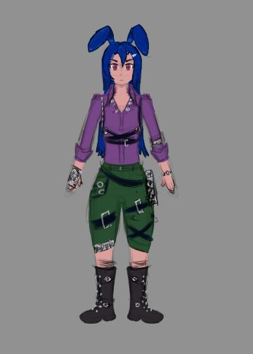
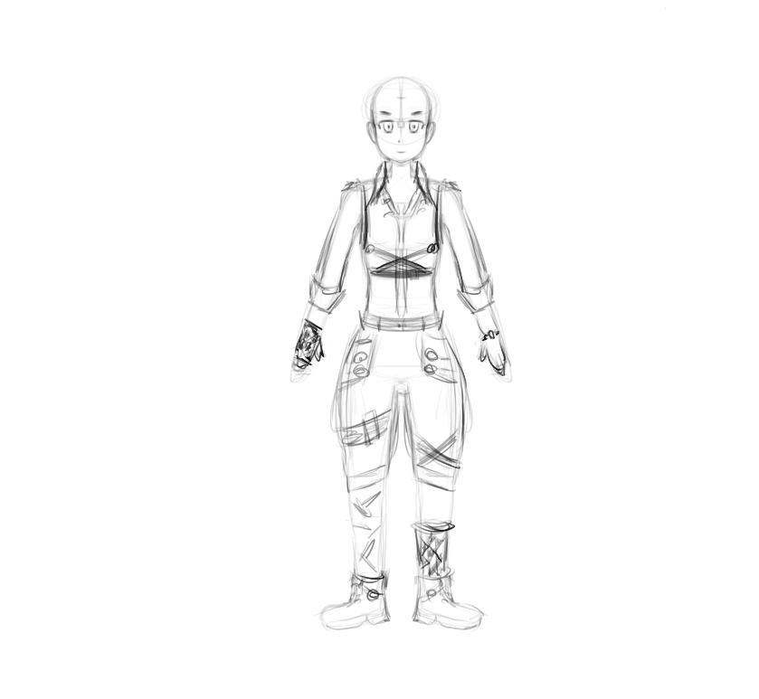