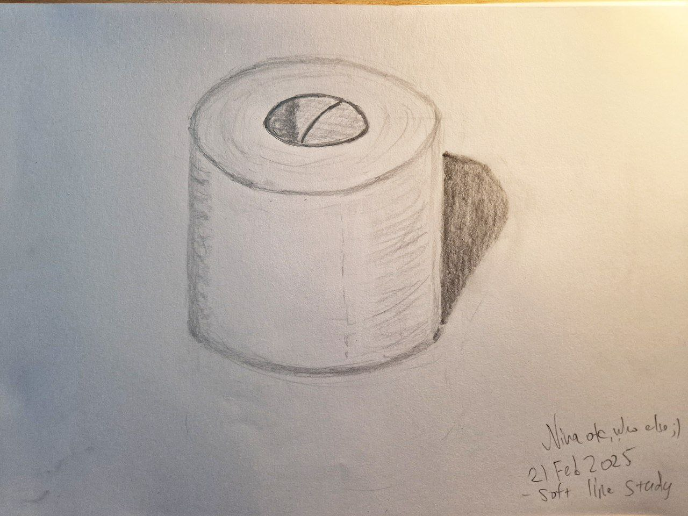
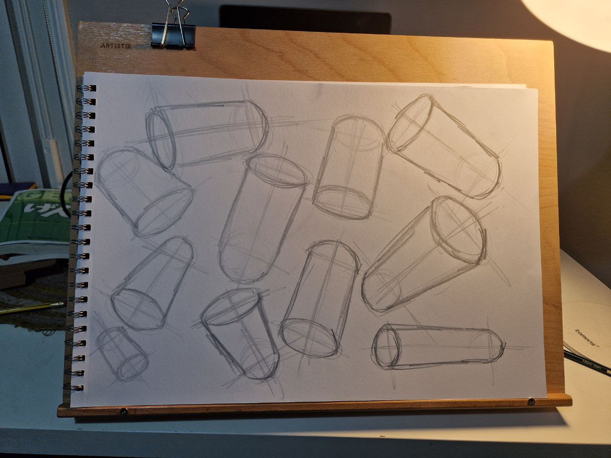

<h1>I see, I can draw!</h1>

A brief reflection on learning drawing skills as an adult by Nina Kalinina, March 14th, 2025

I've wanted to draw for over a decade, but couldn't. And then I started practising, about a month and a half ago, and went from child-like scribbles to being able to complete a self-portrait with considerable likeness - after merely 40 hours of practice. 

 

I am not a genius, nor have I invented my unique way of practising; I merely followed a few art manuals. This note is to document my progress. People who wanted to draw for a long time but never figured out how to do it may find my observations interesting. However, I have to say that this note is not a substitute for drawing lessons, nor a guarantee that your experience will be similar to mine.

Please direct your comments to this [Mastodon thread](https://tech.lgbt/@nina_kali_nina/114162962108293528).

## The shoemaker's children go barefoot

As some of you know, I do all sorts of art, from pushing pixels to collages. I even run a couple of webcomics! And precisely because of that, my friends sometimes ask me:

"Aren't you the artist? 😅"

I used to shrivel in shame hearing the question. "No, I just write the script and such. I'm really not very good at drawing."

My significant parental figure detested art. As a teenager, I attempted to share the best of my drawings with them a few times, but each time I met such harsh criticism it was beyond obvious that my skills are inadequate, and I should not waste my time on art. 

Even after I freed myself from their influence, the idea of me picking up drawing seemed pointless and futile. Perhaps, this is because my long-term partner was a commercial illustrator. Whatever I tried to draw seemed painfully inferior compared to professional art. Moreover, if I needed a drawing, I could simply ask my partner for one (at least in theory). 

We've divorced a bit over a year ago. It is hard to express how happy about this fact I am.

However, one doesn't just rethink their life overnight. I didn't feel like I should start seriously learning to draw until... until I got inspired, I guess?

A cover of a manga (Japanese comic book) called "Blue Period", depicting a young man boldly drawing a red line with a massive brush.

One fateful night (January 6th, 2025) I decided to re-watch an anime series "Blue Period". It is a story about a boy who discovered his passion for drawing only in his second year of high school. As it happens, the anime is based on manga and only covers the beginning of the story. I started reading the manga on the 17th of January, and by the 26th of January was so immersed in the world of art education I found my copy of Betty Edwards' "Drawing on the right side of the brain".

## Drawing on the mean side of the brain

I have had a copy of Betty Edwards' book since 2011. The book makes extraordinary claims and proves those with five-day courses where students go from "I can't really draw" to being able to produce a decent self-portrait. 

The back cover of Betty Edwards' "Drawing on the Right Side of the Brain" shows the incredible progress her students made over a few days.

Yes, it sounds too good to be true. Yes, it is (kind of, sort of) true. My progress over the 40 hours of practice you have seen as a preview of this post is yet another testimony to this book.

However, this book is very **mean**. It forces the reader to produce "ugly" drawings and evaluate them. This is a very bitter pill to swallow. I have tried it twice before and failed.

The book is also quite **hard**. It often references the five-day course, and it made me feel like I was too slow and weak. Not everyone can draw for 8 hours a day. I mostly managed to draw one hour a day, with a few exceptions. Being able to draw for one hour a day for 40 days in a row is a challenge. Being able to do it every day while seeing that the results you're getting are not "good" is a massive challenge.

I suspect this is why this book has been collecting dust on my shelf for so many years.

Here are the three drawings I made over the course of two days to record my baseline art abilities. I am **not** proud. But I have to share this.

 

 

As you can see, I had very poor control over my lines, poor understanding of proportions, no understanding of light and shadow, and no idea how to draw noses. The result, however, was not as bad as I feared, perhaps due to my engineering background and hours wasted on pencilling technical charts for machining.

If you think baseline drawings are bad, think twice: the book asks you to draw a few more things out of your imagination to surface the internalised system of symbols. I have added my last year's pixel art attempt to the comparison. Brace for the impact!

 

Despite the appearances, this is actually a very useful exercise. Drawing is a written language without words; many languages actually use the verb "to write" to refer to drawing! In drawing, just like in writing, we rely on a set of symbols and shortcuts we use to express ideas. These symbols are often reminiscent of hieroglyphs, highly culture-specific, and very hard to shake off. We see a symbol for an eye, and we think "eye". We want to draw an eye as we see it and end up drawing a symbol for it.

The book seems to set its goal to teach how to break free of these symbols and draw things as we really see them.

## Cheap tricks, cheap trills

The first real exercise the book gives its readers is "upside-down drawing". The idea is to copy a line art drawing while the original drawing is turned upside down. Apparently, most people are able to improve their copying skills instantly this way because their brain stops seeing familiar symbols, and only sees lines and shapes.

> Note: the book makes a point that drawing from the real world and even from imagination is not that different from copying other drawings. However, drawing from the imagination means one has to be able to imagine with great details objects, shapes, lights and shadows - which is a system of symbols in itself - this is something one has to learn from different sources.

 

To me, this has been a half-truth and a minor disappointment. It is true that my upside-down copies ended up looking better than I could've managed a regular copy. It is also true that the proportions of the drawings were very off!

Turns out that drawing on a horizontal surface does weird things to our perception of sizes and proportions! The far side of the image ends up being far further from our eyes than we expect, and the image we copy ends up stretched. I got myself a tilted plywood **easel**, and that countered this "stretching" considerably.

> Note: it doesn't have to be an easel, a chopping board or a large book would do if you only use standard printer paper.

## The image plane

The second major challenge from the book is drawing a hand. The book uses a "cheating tool" commonly known as a viewfinder and first asks to draw things directly on it. I wonder why viewfinders are considered cheating in modern art instruction! "Perspective machines", not dissimilar to simple viewfinders, used to be instrumental for the Western understanding of perspective, but went out of fashion with the advent of photography.

Drawing a hand as it can be seen directly through the plastic of the viewfinder feels like cheating. "Will it really make me better at drawing?", I wondered. Spoiler: yes, it did.

The book makes a point: adding <ruby>pizzazz <rt>/pĭ-zăz′/</rt></ruby> and polish to the drawing will make it look more skilled. Moreover, completing a drawing brings a sense of satisfaction (unless you are traumatised and hate yourself for even attempting to draw). So, the book asks to copy the drawing to a piece of toned paper.

 

Toning paper is fun and a bit meditative. The black charcoal powder becomes a pretty silver tone! It doesn't just make your drawing look better, it improves your drawing skills by reducing the contrast between the paper and the pencil. Mistakes you make are less noticeable and less important; you have to seriously focus on darkening the lines if you want the viewer to see them. On top of that, adding a few finishing touches with an eraser can bring out the perceived volume of the shapes.

 

> Note: if you want to draw on white paper, you will need to find other ways of making the mistakes less noticeable and less important. It took me only about an hour of practising to learn how to leave pencil marks that cannot be seen from 2 meters (6 feet) away.

Here is what I had to say about this exercise to my friend:

> That's 7 hours of drawing since the completion of the pre-instruction drawings. I think I made the lines on the palm way too dark, but I still don't quite understand how to make them look right.

> But GOSH DARNIT why the drawing says so much about me

> Like, how many times I’m second-guessing the line? how many times I’m blurring the things, over and over? how many times I erase and draw over only to erase again...

## The art and science of doodling

And so I realised that I still don't have good control over my lines. The artists? They can produce pretty lines. Me? No, not really. Can I do something about this? 

A long time ago, my ex recommended a course "The Art and Science of Drawing" by Brent Eviston to everyone. I decided I should give it a go.

This is not <b>the</b> cover image for the course, but I think it sets a relatively realistic expectations on what the course is about.

And guess what, this course is a gem! It is also a lot of work. In the best traditions of 20th-century art education, in its first week, it will ask you to draw hundreds of basic shapes: circles, ovals, and rectangles. I drew so many ovals my shoulder was hurting, but I could see how different muscle movements affect the lines I draw. I learned that my **pencil grip was wrong,** and that I was adding too much pressure on the pencil tip.

But more importantly, I learned that normally **artists do not draw perfect lines from the first try**. They start with light imperfect lines, and they draw on top of them, over and over, finding the ideal.

 

Being able to find the biggest shapes and place them on the paper becomes much easier if your first, second, tenth, or twentieth line is still a tentative one. This quick sketch of a cat almost did not require an eraser, despite my moving big parts of the image around the page. At this point, I had 14 hours of total practice time recorded.

Here is a snapshot of my feelings back then:

> I had a thought last night, about the transition from "I can't draw" to "I study how to draw". Unexpectedly, I feel far more confident in my skills just after two weeks of little exercises, and can't honestly say that I feel like I can't draw. I can.

> It's not awesome, full of flaws etc etc etc.

> I don't know how to deliver a final result beautifully yet

> But I can draw.

At this point, I understood the Howard Ikemoto's quote mentioned in the book:
> When my daughter was about seven years old, she asked me one day what I did at work. I told her I worked at the college – that my job was to teach people how to draw. She stared back at me, incredulous, and said, "You mean they forget?"

## Negative spaces

I tried to do the exercises from the Right Side textbook in parallel with finding more confidence in my lines and quickly discovered that being able to copy lines from the viewfinder does not always result in a good drawing. The lines could be perfectly copied, but the drawing will look confusing if it is done without the understanding of volumes.

 

Finding better candidates for drawing, and better composition (using the viewfinder just like a photo camera) would result in a better outcome.

As you understand, no one can rely on the viewfinder (or image plane) for drawing forever. There is even a very practical aspect: the image plane is too small, and capturing all the tiny details on it is impossible. The textbook offers a solution for this: edge perception through the negative spaces. Instead of drawing the object, draw the space around it. This is how one can draw visual paradoxes. For example, chairs in perspective, where the front legs are visually twice as long as the back legs, despite literally being the same physical length.

Here is what I told my friend about this exercise:

> Negative space and fill study in pencil and coal. The hard part about this job is starting from grey and trying to darken the area without the chair while adding more white to the area inside of the place where should have been the chair. It's incredible how many layers of dark and light can be added on top of a silvery layer of graphite (three or four layers of white, 6 or 7 layers of graphite at the very least), and how much energy it takes (maybe 30m to get the chair shape right, and then 1h30m to tone it, correcting the lines on each step). 

> It looks quite like art, with lots of different tones here and there, but while the fills are intentional, and the composition isn't terribly boring, I understand what Blue Period says about the exam art and why it's not art: it's just a chair, it doesn't try to answer any question, it just is.

A frame from the Blue Period manga; an art professor is not happy about their students being conceited.

Undeniably, even "just a drawing of an ordinary chair, without deeper intent" is a piece of art. It is just not a very well-thought-out piece of art.

 

Drawing in negative spaces is fascinating. It does not solve away all the perspective problems, but for small-ish objects, it genuinely helps to notice and truthfully depict all the little twists and turns of the lines.

_You probably have noticed that by this point I sort of started to develop a signature. "Nina ofc", because who else would draw this?_

## The grand illusion begins to unravel

The "Drawing on the Right Side of the Brain" asks the readers to draw what they see, and believe that whatever they draw will accurately reflect reality. "The Art and Science of Drawing", however, points out that a drawing is always an illusion. The drawings are made of lines, but the world we see through our eyes is not made out of lines. A close look at the masters of drawing reveals that they pile up all sorts of marks and lines that, from a certain distance, evoke the feeling of a realistic volume. And if that is the case, it is worth learning all sorts of mark-making!

 

Moreover, silly humans tend to pick up emotions behind the lines and the marks. Compare a cup drawn as "Firm and unapologetic, even if sharp at times" with a cup made of "Vibrating thick white clay". Both drawings use the same template, but the character of the lines is different between the two.

 

It was shocking for me to learn that different marks made by the very same pencil can evoke feelings of various textures. The perspective and the shadows in the study below are not important (and "wrong" in a certain sense); the goal was to try and make the objects drawn feel "soft", "hard", and "slick". 

 

Around the same time, I discovered that the beautiful "lost-and-found" line I tried to replicate (semi-consciously) is basically impossible with pencils but easily achievable with a brush.

## Break!

At this point, I have been practising art almost every day for three weeks and started to feel like I am forming a habit. What is the best way to break a habit? A week-long business trip! Could it be an opportunity, though?

Surely it is not a good opportunity to practice live drawing. Art supplies are bulky; I've used maybe 20 pages of my A5 sketchbook and got convinced that drawing on small formats is a special skill for which I am not quite ready yet.

One little insightful experiment I did during my trip was trying two approaches to live drawings. One approach, advocated by the "Drawing on the Right Side", is drawing a reference line ("Basic Unit"); and then drawing everything else in relation to it by sighting relative size and position. Another approach, from "The Art and Science", is to start with placing the largest shape, and draw from it.

 

The first approach, surprisingly, results in better composition. The second approach, for me, results in better proportions overall, and a more faithful representation of the object. Looking at these sketches now, I can say with certainty that neither managed to capture the object in perspective correctly. After trying multiple ways of starting a drawing, again and again, I found that I liked the second approach better.

When practising drawing became close to impossible, I decided to read some important books about art instead. "Why Art Cannot Be Taught" is one of those, and a great read for a long-haul flight.

I am not going to summarise the whole book for you here, but here are some of the insights I got from it:

* The art education and the art skill education are two different things,
* Historically, the art education in the West focused on the art skills, but not in the last hundred years,
* Contemporary art education often stresses politics and ideology over skills, and it probably should,
* "The fact is that oil painting is a lost art several times over, and what we call oil painting bears very little resemblance to what past centuries knew by that name",
* The art education has become a past time activity for the rich during the Victorian era,
* Western art and Western perspective are far from being "the correct way of seeing things",
* Industrial and even commercial art, including design and illustrations, are considered unimportant and low-brow by the fine art world,
* Computing is, in a way, a branch of fine arts.

Even more impressive was the "Ways of Seeing" by Berger.

It is a British TV show from the 70s that you can [watch it on YouTube](https://www.youtube.com/watch?v=0pDE4VX_9Kk) these days. Berger brings Marxist criticism of art in every house! Just consider:

* Art is re-contextualised with its placement, and can be trivialised or weaponised;
* Western art objectifies and dehumanises women through its continuing tradition of nude;
* Oil paintings are objects of tremendous value, and a big chunk of art is a display of wealth and power, especially through life-like representation of textures;
* For the last century, the advertisement industry and publicity have been leveraging the same techniques and ideas as oil paintings.

Those two reads are such a great addition to the "art education" I have received from reading 16 volumes of "The Blue Period". xD

After such a crash course in art, I visited two museums (SF MOMA and The Legion of Honor Fine Arts Museum) and enjoyed both immensely. The Museum of Modern Art felt like it was all about the message and the intent behind the art. The Fine Arts Museum, however, was a field trip to the lands of "no time to explain, must draw".

For example, there are many fabulous drawings that were made before the artists figured out how to do realistic anatomy (and anyway, realistic anatomy was not as significant as the symbolism behind the art, and perfection of idealised proportions).

Incredible, huge, colourful drawings that probably took months, were made by artists who had no clue about "realistic" perspective. Indeed, a much better way to spend the artist's time is to make sure that the painting glows in the candlelight. The lost art of oil painting is relevant to this topic; many old paintings were drawn on reflective surfaces with translucent oil (or egg).

The Legion of Honor Museum had an exhibition about theatre-related arts. It was remarkable to see drawings and paintings made without the direct intent of representing wealth. Watercolour, gouache, pencil, stencil, anything goes! The art that sometimes does not even look like it belongs to a museum. What a delight!

Being able to take an intensely close look at pencil drawings was rewarding, too. Incredibly talented artist *also* had a hard time with perspective, proportions and the character of their lines.

## The world of lies

You can imagine that I was pumped up when I finally got back home. Even a fever did not stop me from drawing hundreds of practice sketches over dozens of pages. At least it was not hard. In the best traditions of classical art education, "The Art and Science" made me draw cylinders, spheres and cubes. But why?

 

Remember the "Drawing on the Right Side" mentioned the system of symbols humans use in their drawings? There is a counterpart of this related to the phenomenon of "canonical perspective": we draw what we *think*. It is counter-intuitive to draw the flat bottom of a cup being curved because we *know* it is flat; it is frustratingly weird to draw only two or three sides of a cube standing on the table when we *can easily see four sides* by looking at the cube from different angles (sometimes it can be as simple as seeing the cube with *both* eyes, if the cube is close enough to the face).

So, a big part of the practice was learning how the illusion of volumetric objects works in drawing. Another part of the practice was to sight some objects from the world and draw them with the correct Western-style 3-point perspective.

 

As you can witness, drawing a "sighted" cube as it "should be" in a 3-point perspective is not just satisfying, but also far more frustrating than I thought.

To compensate for this frustration, I picked up a few more drawing tools to increase the range of expressions I could do.

## Is it all about perspectives?

"Drawing on the Right Side" also teaches perspective, but is a bit more informal about. It mostly focuses on single-point perspective for things like streets and corridors, and two-point perspective for indoor drawings.

The biggest aha moment for me here was "I should not poke through the image plane". Even before my current practice run, I've been using my pencil to measure sizes and angles, probably because I have seen it so many times. The thing is, I did not quite understand how it was supposed to work. I used to align the pencil with the edge of the object. Humans with binocular vision tend to perceive objects in three dimensions, and align their pencil along the edge of the object *in three dimensions as well*.

But drawings and photographs are two-dimensional. Turning the pencil towads the object "pokes through the image plane", and the dimensions taken by it become incorrect. It is said that we might attribute part of Rembrandt's genius to his lack of binocular vision!

 

You can see that the minimal understanding of the perspective has resulted in much better proportions in the drawing. By comparing my new drawing with my baseline drawing, I also noticed that I was vulnerable to "drawing as I know"; drawing dimensions of the objects proportionally to their physical size and not their observed dimensions.

The easiest fix for the "pencil sighting" issues is to put a glass frame in front of you. A pencil cannot poke through it!  This conveniently means sighting correct angles and dimensions. Shortly after becoming conscious of this issue, I figured out to always check that I move my pencil only in two dimensions when sighting, keeping it parallel to my "plane" of vision.

> Having the paper toned adds to the "professionalism" of the result. Nice. I think an extra ten hours to perfect the lines and shades would have resulted in a better drawing, but who has time for that?

## Faces

The final challenge from "Drawing on the Right Side" is portraits. Portraits are great for drawing practice: it is easy to slip into using symbols instead of observed edges, angles and proportions; it is easy to misinterpret the dimensions; it is painfully obvious when the drawing is wrong.

Betty Edwards' approach to portraits is similar to "The Art and Science" approach to everything: learn the science of it. A good practice of portrait drawing is copying a portrait while observing the dimensions, proportions and shapes of the faces.

A study of "Portrait of Madame X" by John Singer Sargent, copied by yours truly.

Turns out, **human faces are surprisingly predictable**. Positions of eyes, chins, ears, and foreheads are all quite similar from human to human. Learning these proportions helps a lot. Remembering that featureless parts of faces (foreheads and cheeks) are surprisingly vast helps even more.

 

New pixel art (left) vs my last-year attempt at drawing (right).

Does this knowledge help to draw better anime-style pixel portraits? Well, sort of, as you can see in my first-in-a-long-time original drawing! Anime-style portraits still rely on standard proportions and illusions of volume. At the same time, anime-style illustrations **extensively use their own system of symbols**. Anime eyes are not representative of human eyes, nor anime noses, mouths, or heads in general. They are symbolic because we **culturally associate these symbols with moe or cuteness**.

As you can see, facial proportion mnemonics really unlock the ability to draw portraits with considerable likeness. Precise details, like nose and lips, are most easily drawn with the concept of negative spaces ("draw space around the thing"). 

# Lights and shadows

The portrait above lacks volume. "Drawing on the Right Side" says that perception of lights and shadows, and drawing them "as we see them" is all it takes to create a volumetric drawing. The book explains the basics of the theory of light, but does not do a great job here, I think. 

In one of the earlier chapters, Edwards captures her exchange with an art student: "Can't you see?" - "No, I can't." 

Unfortunately, in my case, "I can't see" the shadows. More specifically, realistic depiction of light and shadow requires distinguishing perhaps 8 or more shades of grey, and, more importantly, being able to tell that two shades of grey are objectively the same, even if they create a visual illusion of being different shades.

The checker shadow illusion, originally published by Edward H. Adelson, vectorised by Pbroks13 for Wikipedia; CC BY-SA 4.0. Square A is exactly the same shade of grey as square B.

A study of "Self-Portrait with Brush and Palette" by Edward Steichen, by yours truly

"The eyes fear, the hands do", as my class teacher used to say. It is really challenging to make a pure black tone with a pencil, so I added a considerable amount of charcoal to the page. Adding "blackness" is much easier than removing it, so whatever proportions I messed up are going to stay messed up. I think I managed to get to 5 or 6 shades of grey in this study, and my brain has seriously overheated.

My face resembled Kuwana-san's from the Blue Period, and my drawing table required a good cleaning afterwards too.

A self-portrait in lights and shadows is the last exercise I have done for the "Drawing on the Right Side".

It took me two attempts to get to this result; two hours for this project, and a bit under 40 hours of practice in total, excluding time spent reading and exploring museums.

Getting the proportions wrong results in terribly distorted images. Getting the shades misperceived breaks the illusion of volume. Squinting really hard, I managed to generally map 8 different shades of grey over my face (including white and black). I used "hard light" from a spotlight to dramatically light my face and simplify reading the shades of grey.

Drawing 8 distinct shades of grey with two pencils (HB and 4B) is a challenge in itself. The book recommends using toned paper and an eraser to add 2-3 extra shades of grey and practice cross-hatching to create darker shades. I am not confident in my hatching skills, and I wanted black to be *really* black, so I used COPIC felt-tip markers and Indian ink on top of pencils. Not being a professional artist, I did not want to invest in extremely expensive markers, so my COPIC set was limited only to basic colours. Among those, I only had three shades of grey, everything else had to be an improvisation.

The textbook doesn't really explain how to draw hair, so I tried to just draw whatever, and kind of failed at it. Nevertheless, I am impressed with the progress I have made in the last 40 hours of drawing.

I was hoping to make a self-portrait that would depict me as a cool beauty. But it was past 9 PM after a work day, after two weeks of annoying cold and sleepless nights, and I positively could not keep my facial expression cool. I just drew what I saw (with the exception of learned proportions and negative spaces). I made quite a few mistakes that would have been immediately obvious had I stepped out from the easel, but that would've stopped me dead in the tracks.

So, it is what it is.

I decided to call the project complete after cleaning up some lines and shapes using an easel under a regular light. I had left the room, and on my way to the kitchen, I glanced back. I was startled. The situation and the drawing looked downright surreal. Did I just... draw this?

Yes, I did.

## Beyond Journey's End

The cruelty and the beauty of studying drawing is that it never ends. 

There are so many topics I have to learn if I want to draw better: the volumetric drawing, the theory of light, the theory of colour, and, most dearly to me, the symbolism of anime illustration. Perhaps, one day I will share with you my thoughts on some of these topics. But I'm pretty sure that I am at the point where it doesn't make sense to record every 30 minutes I have used practising drawing. Because I can just draw instead, and then draw some more.

_**To be continued...**_
