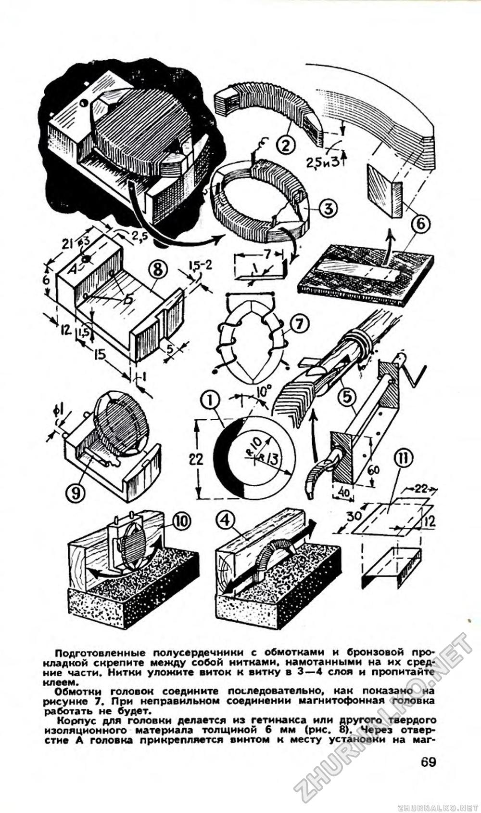

# Magnetophone heads

Young Technician, January 1959

A. Markellov, drawing by S. Vecrumb

Required materials: transformer steel from transformers or permalloy 0,32 - 0,45 mm thick; PEL-0,2 wire 
(copper 0.2mm, insulation); PEL-0,05 wire (copper 0.05, insulation); BF-2 glue (polyvinyl 
butrial phenol); non-waxed sewing threads.

First of all, you should cut out a template of the core plate from a thick tin plate (Fig. 1). The edges of the cut 
out template are cleaned with a file and a sharpened awl. Draw the template on the material prepared for the core. 
The number of plates you take depends on what kind of tape recorder you need the head 
for. For a tape recorder with one-track recording, the thickness of the set for both universal and erasing heads 
should be equal to 7 mm. For a tape recorder with two-track recording: for the universal head - 2.5 mm, and for the 
erasing head - 3 mm (Fig. 2).

Having cleaned the edges of the cut plates with a fine file, you assemble from them half-cores of the required 
thickness. You glue the plates with glue BF-2 and immediately, while the glue is still dry, wrap them coil to coil 
with two layers of thin threads. Soak the coiled threads with glue BF-2 - and the frame for wrapping is ready.

On each half-core, again with the help of threads and glue, it is necessary to install one lobe from a 0.5 mm thick 
brass strip (Fig. 3) for the winding ends. Shims of paper are glued under the lobe and on it. The bent end of the 
lobe should be tinned before installation, and the threads holding the lobe should be soaked in glue. Dry the 
assembled cores with the lobes in place and do not proceed with further work until the glue has fully cured.

The joints of the half cores of each head must be sanded well on a fine block. To prevent the surfaces from being 
distorted during sanding, place a hard wall at right angles on the bar. Then, lightly pressing the half-core to the 
wall and the bar at the same time, carefully grind the surfaces of the half-core (Fig. 4). The cores must be in full 
contact with each other with their ground surfaces.

For the universal head, 1500 turns of PEL-0.05 wire should be placed on each half-core, for the erasing head - 200 
turns of PEL-0.2 wire. Working with thin wire requires attention: the wire is easily torn, and soldering or welding 
is undesirable. Winding is best done according to the principle: "You go slower - you will go farther" - and 
carefully monitor the stacked wire. It is possible to construct a small winding machine (Fig. 5). Set the half-core 
in the holder. Now strip the end of the wire by 30-40 mm, wrap it around the tinned lobe and solder it. After 
making sure the soldering is done securely, you can lay the wire. When the winding is finished, use glue and threads 
to install the second lobe - the lead - on the paper pad. After checking for breakage, the laid wire is wrapped with 
two layers of thin threads, and then the threads and wire are soaked in glue BF-2. The threads and glue protect the 
winding from mechanical damage.

In the front part of the head there should be a gap: universal head - 0.01 mm, erase head - 0.1 mm. To obtain such a 
gap, make a gasket from a phosphor bronze plate of the required thickness and glue it with BF-2 glue to one of the 
half-core.

But how to get a plate 0.01 mm thick? Take a contact plate from an old switch. First, grind it with a file, and then 
grind it on a fine-grained bar (better on a piece of rubber, Fig. 6) to the required thickness (until the edge of 
the plate begins to "crumble").

Fasten the prepared half cores with windings and bronze gasket together with threads wound on their middle parts. 
Lay the threads in 3-4 layers coil to coil and soak them in glue.

Connect the head windings in series as shown in Figure 7. If the connection is incorrect, the tape head will not 
work.

The case for the head is made of 6 mm thick getinax or other solid insulating material (Fig. 8). Through hole A the 
head is attached by a screw to the place of installation on the tape recorder. Holes B are used to install output 
terminals. The lead terminals are made of pieces of tinned copper wire according to the diameter of the drilled 
holes (Fig. 9).

A 1 mm thick brass strip is glued into the head housing along the gap line with BF-2 glue (see Fig.). It protects 
the getinax case from abrasion by the tape.

Connect the lead lobes of the head winding to the terminals of the pad with two thin (0.2 mm) tinned copper 
conductors.

The core with windings is glued to the pad with BF-2 glue so that the working joint of the core protrudes 1 mm 
beyond it.

After thorough drying of glue carefully grind the working surface of the head in the same way as when grinding the 
half-core, - first with a fine file, and then with a fine-grained bar.

The protruding end of the core is ground until the depth of the working gap after grinding is equal to 1 mm. During 
grinding, the bars should also be fixed on some smooth and even surface (Fig. 10).

To protect the heads from external electric fields, screens should be made (Fig. 11). For the universal head - from 
well annealed sheet iron 2 mm thick, for the erase head - from red copper sheet 2 mm thick.

The quality of work of the tape head depends on the material of the core, the quality of grinding of the working 
surfaces, the size of the working gap and careful execution of all works.

The tape heads described in this issue of the magazine can be installed on any tape puller of any design.
