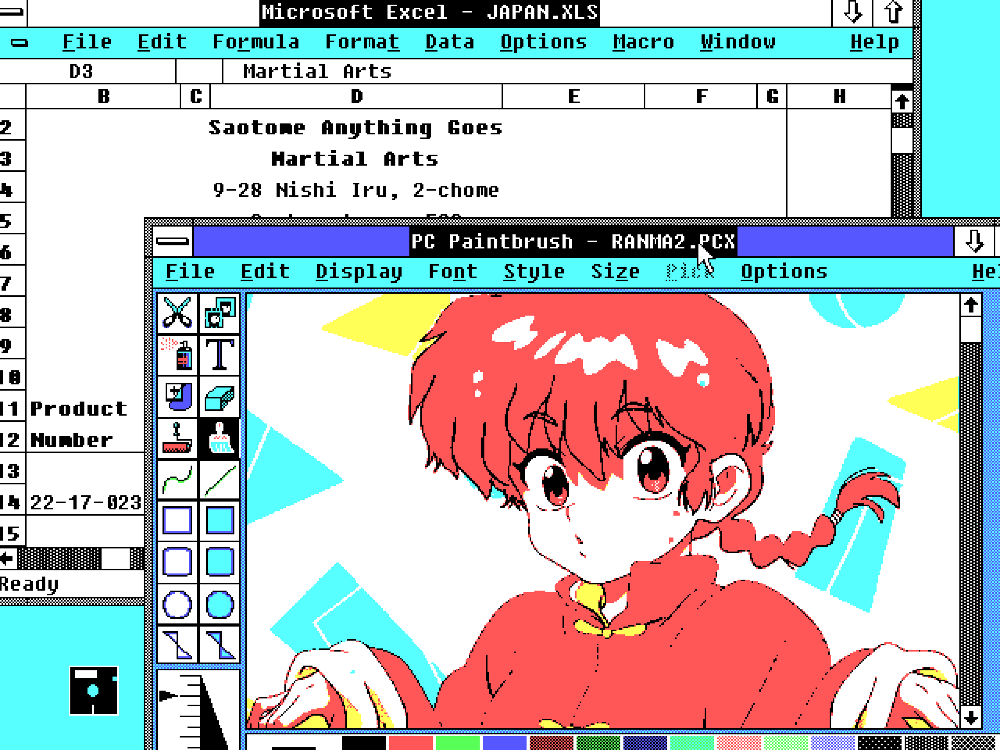
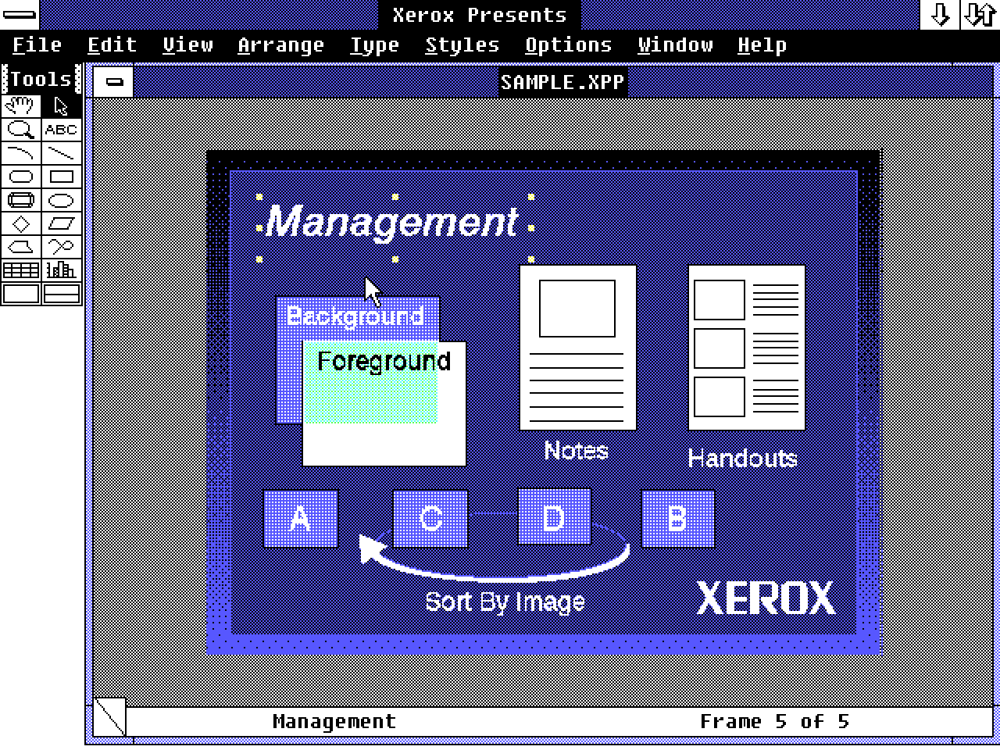
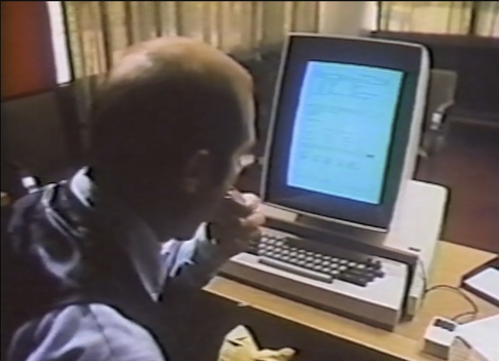
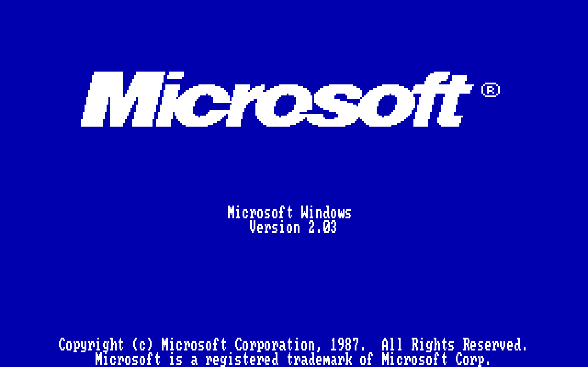
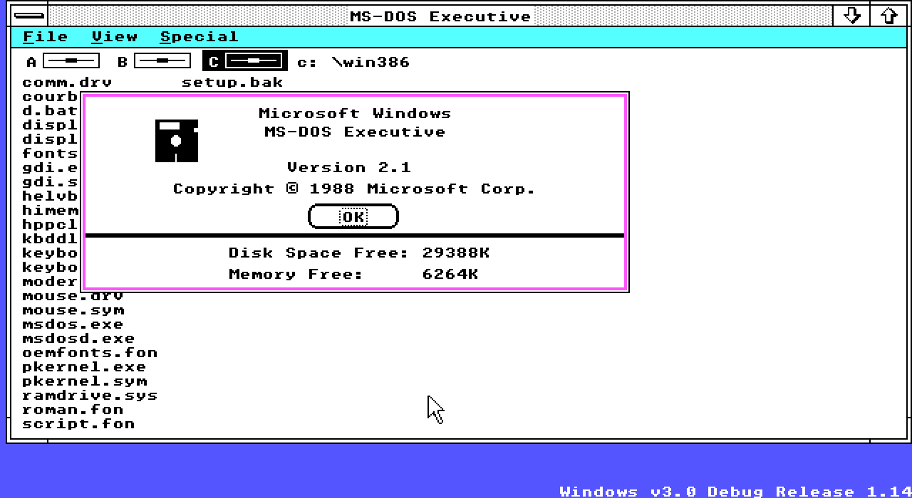

# Windows 2: Final Fantasy of operating systems

by Nina Kalinina, December 31st, 2024 (rev. 1.05 2025-01-02)

It is common knowledge that Final Fantasy could have been the "final" game for the studio, the first and the last in the series. It is far less known that Windows 2, released around the same time, faced a similar fate. If anything, things were more certain: even Microsoft firmly believed that Windows 2 would be the last.

PC Paintbrush and MS Excel were some of the most successful programs for Windows 2.

The miracle of overwhelming commercial success brought incredible attention to Windows. The retro community and computer historians generally seem to be interested in the legendary origins of the system (how it all began) or in its turnabout Windows 3.0 release (what did they do right?). 

This story instead will be about the underdog of Windows, version 2. To understand where it all went wrong, we must start looking at events that happened even before Microsoft was founded. By necessity, I will talk a lot about the origins of Windows, too. Instead of following interpersonal/corporate drama, I will try to focus on the technical aspects of Windows and its competitors, as well as the technological limitations of the computers around the time. Some details are so convoluted and obscure that even *multiple Microsoft sources, including Raymond Chen*, are wrong about essential technical details. It is going to be quite a journey, and it might seem a bit random, but I promise that eventually, it all will start making sense.

If you have comments or feedback, please leave it in <a href="https://tech.lgbt/@nina_kali_nina/113749698753812898">the Mastodon thread</a>.

But let's start with some hands-on Windows 2 experience, so you will be tempted to read the full story!

## Living with Windows 2
Our personal TARDIS took us to the 31st of December 1989 or so. Our test machine is, perhaps, a cheap IBM PC AT clone 286/12 with 1 megabyte of RAM (around $995 for the system and peripherals, depending on the hard drive and monitor). But Windows 2 would work even on a $600 IBM PC XT compatible.

Let me put this into perspective: a decent system that can run Windows 2.0 smoothly runs at 0.012 GHz and has 0.002 gigabytes of RAM. Likely, your phone is at least one hundred times as fast and has one thousand times more RAM.

Most people would experience Windows 2 through a version shipped with Microsoft Excel. It can calculate stonks and plot charts. What else do you need?

### Standard applications
For a number of reasons, standard Windows 2 applications are almost exactly the same as Windows 1 applications.

MS-DOS Executive is sort of a file manager for Windows that is used to start programs.

Notepad is as unassuming as ever. No Copilot yet. Note how minimized applications are represented by an icon on a desktop. This used to be a common idea across many contemporary systems.

Calculator is very minimalistic. Write is clearly Microsoft's response to Apple's MacWrite.

Paint is similar to MacPaint, too. It is monochrome, and it looks exactly like Paint in Windows 1, but uses a different file format (?!).

There is no proper Open file dialog. It was implemented as a part of CommDlg in Windows 3.1.

It's Wild West of modal windows, folks! Also, I wonder what "Microsoft Word format" they mean; there were at least Word For Dos and Word For Mac at this point.

Calendar and Cardfile are more useful than they might seem.

Control panel allows to create your own <a href="http://yo90s.com/windows-hotdog-stand-theme/">Hot Dog Stand</a> interface, if you want. Contrary to the urban legend started by Microsoft, it is *not* the first version of Control Panel.

The networking tools in Windows 2.0 are basically non-existent. The terminal tool is beyond basic.

Built-in entertainment is represented by an intellectual game of reversi. You need 3.0 for Solitaire, 3.1 for Minesweeper, and WfW for Hearts.

### Additional software
The list is non-exhaustive, and even misses some major pieces of software (Corel DRAW!, for example). This is more to illustrate that Windows 2 had *some* useful apps.

Back in the 80s, Microsoft's office apps were much more popular on Mac than on PC. Maybe that's because Word for DOS was really ugly. It took Microsoft years to bring graphical Word on the PC, and you're witnessing it.

Perhaps this is why Microsoft made Project? To release their software in time.

Windows 2 SDK is shipped with a few neat tools for software developers. It is not quite Visual C yet, but it is not not visual.

Aldus Pagemaker was one of the first programs to release for Windows. Some video cards supported screens as large as 1024x768 in 256 colours, which is pretty darn good for typesetting. Pagemaker 3 could use much more RAM than Pagemaker 1, and is actually quite usable.

Adobe Illustrator does not require an account just yet; there is no generative AI in it either.

It is quite basic as far as vector editors go, but it has CMYK and PostScript support.

Xerox Presents is a PowerPoint-style app. There was no PowerPoint for Windows just yet, as Microsoft has just bought the company that made it.

Xerox Presents comes with some nifty vector clipart, and even supports vector scalable fonts.

It is quite obvious that MS-DOS Executive is not a great way to start programs. There were many alternatives, and Clearview was one of the more advanced ones.

Windows Application Manager aims to solve the same problem, but cheaper.

ZSoft Paintbrush is a bit of a pain to use on Windows, because Windows only supports 8 colours on the most common video cards (EGA and VGA, both normally support at least 16 colours). But the program itself looks just like Microsoft Paintbrush from Windows 3.0.

That's right! Because Microsoft has licensed ZSoft Paintbrush for its MS Mouse and MS Windows. Also. you can tell that I just needed an excuse to add two screenshots of the program...

XVT Draw is a shareware vector editor. It feels much faster than Illustrator or DRAW!

Opus Composer, also known as WinSong, was made for Windows 1, but it is slightly more useable on Windows 2. The full version of the progam comes with MIDI support.

Opus Tapedeck is a counterpart for Opus Composer that works just as a player utility.

The genre of desktop organisers seemed to be popular. This is Packrat. Another popular organiser (also called "PIM") for Windows 2 was IBM Current.

CaseLiner is a tool for generating liners for your mixtapes.

Comprog brings networking on Windows 2.0 to the next level: now you can connect to BBSes and download files (BBS, bulletin board system, is sort of a website before websites were a thing).

### Entertainment
There weren't many games for Windows 2, but there were some.

ChessNet allows you to play chess over modem. It's much faster than chess over email!

Remember I told you there is no Solitaire for Windows 2? Turns out, I lied! There is a shareware version that looks nothing like MS Solitaire but still as fun to play.

Backgammon has a case of a quirky interface. It's likely going to work just fine in Windows 1, too.

Crosswords are fun. Don't you like crosswords? Crosswords!

Starbase is probably the only example of an <em>action</em> game for Windows 2. Someone tries to bomb your star base! It is hectic and very violent.

Taipei is very pretty, and this is why I put it at the end.

There are many, many more interesting programs for Windows, including:
* a CAD Engineering Capture, 
* a GIF viewer Easel, 
* an AI graphical expert Nexpert, 
* e-mail clients The Network Courier and Windows mail,
* multiple office applications, including Samna/Lotus Ami, NBI Legend and Palantir WinText.

Now, I hope, you are ready for the history tour? I had to start *somewhere*, and The mother of all demos seemed as good place as any.

## 1968-12 "The mother of all demos"

A lecture later called "The mother of all demos" combines graphic displays, computer mouse, windows, and much more.

 
  
Why was it important?

It has been a few decades since the invention of electronic computers, but they are still so costly only some businesses can afford one. Most people cannot even begin to imagine what they would do with one. A group of scientists tries to imagine what could be done with the computers of the future and prepares a presentation of multiple technologies that will be known as "The mother of all demos".

Incredibly, there is a recording, but it is pretty unimpressive by modern standards: [https://www.youtube.com/watch?v=yJDv-zdhzMY](https://www.youtube.com/watch?v=yJDv-zdhzMY)

Image source: "The mother of all demos" itself.

## 1973-03 Xerox Alto

A research division of Xerox, Xerox PARC, releases an experimental computer "workstation" called Alto. An attempt to streamline "The mother of all demos", Alto is the first mass-produced system with a graphical user interface. The computer is made from hundreds of tiny computer chips, and the price starts at $32,000. There is very little demand for such a computer.

Image source: Xerox's Alto commercial.

## 1977-06 Apple II

Until the release of PC and perhaps even for a few years after it, people usually meant "Apple II" when they were saying "personal computer".

 
  
The boom of microcomputers?

Since 1970, the semiconductor and computer chip industry has kept doubling chip features while keeping the costs relatively constant. By 1977, a whole computer processor, comparable in performance to Apollo Guidance Computer's processor, would fit on a silicon crystal smaller than a fingernail and might cost about $10.

This created an opportunity to produce small, inexpensive computers for individual usage. A remarkable example of such a computer is the Apple II, released in June 1977, with a retail price of $1,298.

Two other significant computers, Commodore PET and TRS-80, were released the same year, and a competitive microcomputer market started to form. There was little software available for these computers at first, and owners often had to write their own programs using built-in BASIC programming language.

## 1979-06 Intel 8088

Intel 8088 central processor is not quite revolutionary, but it packs a good punch. It is 16-bit, and it uses the segment memory model instead of banking.

 
  
Bits? Banking? Segments?

### Integer number sizes

The overwhelming majority of processors in early home computers were "8-bit"; that is, they could operate only with integer numbers between 0 and 255. Computing bigger numbers would require the processor to perform multiple steps. 

If you're struggling to grasp the idea, imagine calculating a sum of 789 and 123 using only sums of single digits: start from the right-most number with 9+3, that's 2 and carry one, then 8+2+carry, that's 1 and carry one, and then 7+1+carry is 9, so the total is 912. Calculating a sum of 1234 and 5678 would require a similar procedure on an 8-bit computer.

A more sophisticated and thus more expensive 16-bit processor could solve this math problem in a single operation because the biggest integer number it can handle is 65,535. A big chunk of computing deals with numbers around this range, so a 16-bit processor with the same "number of operations per second" as an 8-bit processor will likely be much more performant.

### Address bus size

The central processor usually doesn't have much memory to store the data. Instead, it stores data in memory chips connected to the CPU through "address bus" and "data bus". The data bus transfers the actual information back and forth, while the address bus determines where to store the data in memory.

Thus, the address bus size ("width") determines how much RAM the computer can use without relying on engineering tricks. The logic is the same as with the integer sizes: 

8-bit bus = 256 addresses,
16-bit bus = 64K (65,536) addresses, 
20-bit bus = 1M (1,048,576) addresses,
24-bit bus = 16M addresses,
32-bit bus = 4G addresses

When processors calculate the addresses for the address bus, they usually have to deal with the same limitations as during integer calculations. Thus, calculating a 16-bit bus address would require multiple operations on an 8-bit processor.

Unfortunately, any serious computing requires at least a few kilobytes of memory. Hence, computers based on 8-bit processors usually had to have a 16-bit address bus and no choice but to regularly spend multiple operations calculating addresses in the memory.

### Memory management model

The simplest way to use computer memory is sometimes called a "flat model". A computer with a 16-bit address bus using flat memory can have not more than 64K of addressable memory elements. This is a problem because things like text documents, spreadsheets and photos simply do not fit in 64K.

A way to bypass this limitation is to implement "bank switching" (or simply "banking"). Let's say you want 128K of memory on a system with a 16-bit data bus. A common way to implement this is to divide 128K into 8 "banks" of 16K each and add clever circuitry to allow you to choose how these banks are connected to the address bus "on the fly". 

For example, you can have banks 0, 1 and 2 available to the processor at addresses 0, 1x16K and 2x16K, but the 3x16K addresses could be connected to any of the banks. Voila, your 8-bit system (with 16 bit address bus) can access more memory! The downside is that you cannot directly copy things between, say, bank 4 and bank 6, as they cannot be mapped to the "address space" simultaneously.

### Segment memory model

Many 16-bit processors use an advanced variant of bank switching known as "segmentation". With segment memory, a processor can access multiple 64K "segments" simultaneously. For example, x86 processors have a Code Segment, which has the program you execute now, a Data Segment to access your data, an Extra Segment to compare or copy memory between two segments and a Stack Segment to store intermediate calculation results. It is much faster than banking but still requires the programmer to use a lot of magic to avoid the limitations imposed by the 64K segment size.

### Intel 8086 and Intel 8088

Both i86 and i88 are 16-bit processors with 20-bit address bus. This means that they support up to 1 megabyte of RAM. These processors use segment memory to avoid long, expensive memory address computations. Initially, the listed price was $124, but quickly dropped to just $14.

### A glimpse into the future - Motorola 68000
Introduced just a few months after the Intel 8088, Motorola 68000 is a 32-bit processor with a 24-bit address bus and a convenient flat memory model. It was seen as a more expensive chip, with the price tag starting at $125. Curiously, the price decreased to about $15 in just a few years.

## 1979-10 VisiCalc

VisiCorp publishes the first spreadsheet program for home computers, VisiCalc for Apple II. Dubbed "the first killer app for the personal computer", it was massively popular. "I need VisiCalc, so I am going to buy a very expensive computer to run it" level of popular.

It looks like a regular spreadsheet app, yes, but there is no mouse support, and there are no menus. The program, quite simple at its heart, came with a 180 page long manual, because it was impossible to figure out how to use it otherwise.

## 1979-?? Steve Jobs decides to make a computer with a graphical interface

Xerox Palo Alto Research Centre, or PARC.

Steve Jobs sees Xerox Alto in Xerox PARC, and becomes obsessed with graphical interfaces. Shortly after, he strucks a deal with Xerox, where Xerox could buy a chunk of Apple stock in exchange for Xerox'es patents.

> I was so blinded by the first thing they showed me, which was the graphical user interface. I thought it was the best thing I’d ever seen in my life. Now remember it was very flawed. What we saw was incomplete, they’d done a bunch of things wrong, but we didn’t know that at the time. But still \[we] thought they had the germ of the idea\[, it] was there and they’d done it very well. And within – you know – ten minutes it was obvious to me that all computers would work like this some day. It was obvious. You could argue about how many years it would take. You could argue about who the winners and losers might be. You could’t argue about the inevitability, it was so obvious. *-- Steve Jobs, interview for "Triumph of the Nerds"*

This pivots a computer in the development, Apple Lisa, from being a revamp of Apple II into being something completely new.

## 1980-08 IBM starts working on PC

The <s>Blue Giant</s> Big Blue becomes mildly interested in a home computers market, and decides to build a cheap home computer, uncharacteristically for the company outsourcing many parts of the project. A small group of engineers starts working on IBM PC, using Intel 8088 processor because it is the cheapest 16-bit CPU they can find. IBM needs an operating system for their new computer, and starts shopping around.

## 1981-04 Xerox Star 

Xerox polishes ideas from Alto and releases the very first computer using "desktop" paradigm and "folders", Xerox Star 8010. It is a wonderful machine, with a high-resolution screen, mouse, what-you-see-is-what-you-get, and so on. Alas, the basic model costs $75,000.

## 1981-08 IBM PC 

IBM releases its home computer IBM PC, with a price tag starting at an almost reasonable $1,565. IBM PC comes either with BASIC, or a disk operating system called PC-DOS. Either way, all you're getting is black screen with white (or green) letters on it. The operating system was developed by Microsoft, a compiler company that supplied BASIC to maybe half of all the home computers.

The computer, as expected from an i8088-based one, had a segment memory model. While the processor supported up to 1 megabyte of address space, large areas of it were pre-allocated for service usage, so the maximum amount of memory a user could have was limited to 640K. Which was still a lot for the time, because the BASIC model of IBM PC would have only 16K. Moreover, 8-bit contemporaries would rarely have more than 64 or 128K.

## 1981-09 Rumours about Apple Lisa

Three years in the works, Apple Lisa starts to get a shape. Rumours about it start spreading around the industry, naming it an upcoming Xerox Star competitor. Journalists are thrilled to learn that it probably will support a mouse (which was invented a long ago, but was not a common accessory just yet).

## 1981-09 Microsoft Interface Manager (?)

Even in the early 80s there was a big demand for user-friendliness. Microsoft starts investing into its own user-friendly interface, as seen in the above note from Paul Allen (c. 1982). It is likely that the work on something known internally as Interface Manager has begun not later than in September 1981.

> In 1981, the Apps division of Microsoft (Microsoft had two primary divisions during this time - "Systems" and "Apps", for systems software and application development respectively) began to develop a common interface library for all of the productivity applications being developed within the division at the time (mostly Word and the Multiplan spreadsheet). This went by several names, notably MUSH (Microsoft User SHell) and Interface Manager, and is an entirely text-mode UI framework signified by the "session control" strip with context-specific commands at the bottom of the screen. There were also brief plans for a "visual shell" using this UI to be shipped using DOS 2.0, but these were scrapped before the final release. Variants of the MUSH/Interface Manager interface would ship in DOS Word 1.0 and Multiplan in 1982... *-- Betawiki*

It all started with Charles Simonyi. He created the first WYSIWYG word processor for Xerox PARC, got tired of it, and around 1980, was looking for new opportunities. His ex-coworker and founder of 3Com, Robert Metcalfe, has introduced Charles to Bill Gates, where Simonyi started working on a spreadsheet program. Shortly after, Simonyi hired his co-worker from Xerox PARC, Richard Brodie, to help with Multiplan. This was the beginning of the Apps division. It is said [citation needed] that when Brodie joined Microsoft, Multiplan did not have a menu system just yet, and Brodie was insistent on adding one. Brodie himself mentions that he primarily was working on Microsoft p-Code C compiler, though. So, this might or might not be the beginning of the Windows code.

## 1981-11 VisiCalc's developers are actively working on a graphical interface

Impressive interface of Xerox Star and rumours about not-yet-released Lisa make the creators of VisiCalc consider their future investment. The company's president learns about a small team from Texas (Scott Warren and Dennis Abbe) who created a variant of Xerox PARC's Smalltalk with a windowing interface for seriously underpowered home computers, and hires them to create the company's next big thing.

## 1982-08 Microsoft Multiplan

As mentioned earlier, Microsoft has been working on their own VisiCalc competitor. It was released in August 1982, and despite the rock star project's staff, it wasn't selling all too well. Journalists are curious whether Microsoft might release a word processor, and the company's representative hints that they might be working on a mouse-controlled interface:

> The way that the word processor becomes really nice is when you get away from keyboard input. Which means, use keyboard input for words only and use something like a mouse, or a joy stick, or a track ball for the editing commands. -- Vern Raburn, President of Microsoft Consumer Products, in interview for PC Magazine April 1982

The command strip bar at the bottom of the screen was considered quite user-friendly at the time. Note that even the very first release of Multiplan supports multiple "windows" to display multiple spreadsheets simultaneously.

## 1982-11 VisiCorp presents VisiOn on COMDEX

A demo of VisiOn, the graphical multi-tasking shell by VisiCorp, is a smash hit on the biggest PC conference COMDEX. Multiple sources quote that it influenced Bill Gates to prioritise work on what later will become "Windows", but it is unclear whether he was inspired or outraged. Perhaps, he was not comfortable with VisiCorp entering his home turf, operating systems (despite Microsoft just entering the VisiCorp's one). Some go as far as to claim that Gates wanted to copy VisiOn, but this is unlikely: he already had people with Xerox PARC experience working on a graphical interface, and even put a Xerox Star in the office to "inspire" other engineers.

## 1982-12 Sun Window System is being developed

Star, Lisa, and now VisiOn created sort of a "user interface fever", it seems. Even Sun Microsystems begins working on a Sun Window System for its pricey computer Sun-1. Sun-1 was a "workstation", kind of a super beefy computer for science, technology and networking.

## 1983-01 Apple Lisa

Xerox Star was pretty close to the idea of modern computers, but it was still very rough around the corners. For example, if one window would overlap with the other, the bottom window would stop updating. Not a big deal unless your bottom window is a clock or a mail app. Apple Lisa, though, polished the interface. Just check out this [video](https://youtu.be/m1rROTVVHls?t=405). It was more affordable than Star, but $9,995 was still quite a price tag.

> "The most important development in computers in the last five years, easily outpacing [the IBM PC]" 
*-- BYTE, 1983-02*

Despite the praise, the series was a commercial failure, likely due to its high cost and annoying slowness.

## 1983-02 PC Magazine declares 1983 the year of mouse

If you skim over PC Magazine from 1982, you are more likely to find a mention of Mickey Mouse than a "mouse" as a pointer device. The next year, though, they proclaim "The Year of Mouse on PC". The actual year of mouse in the Lunar calendar was actually 1984, what a shame. A big feature of the February issue is not-yet released VisiOn which is going to be all about the mouse.

>  This issue marks the unofficial IBM debut of California’s second-most famous rodent: the computer mouse. (Mickey and Minnie’s first-born, "Micro”?) *-- PC Mag, February 1983*

> ...menu-driven systems as Apple’s new Lisa or the Xerox 8010 (better known as the “Star”) have, in fact, elevated the mouse's status from a laboratory curiosity to rodent stardom. *-- "The Tale Of The Mouse", PC Mag, 02/83*

> You simply point to what you want to do by using a mouse... VisiOn handles windows on the screen in a way that makes it look as if one piece of paper is on top of another... *-- "VisiOn, a mouse on the digital desktop", PC Mag, 02/83*

The magazine mentions a multitude of vendors, most notably, Mouse Systems. Mouse Systems was responsible for Sun's mice, and was the first company to offer a mouse for PC. Naturally, VisiOn is expected to use Mouse Systems as well.

## 1983-04 Microsoft Interface Manager internal demo

New Microsoft logo from around that time.

According to "Barbarians led by Bill Gates" by Eller, somewhere around late 1982, a small team of engineers at Microsoft was tasked to copy VisiOn and reverse-engineer Xerox Star. The result of a few months of work, a demo called "Interface Manager", was presented internally in April 1983.

## 1983-05 Microsoft Mouse and Multi-Tool Notepad

Back in 1983, there was no software using computer mice just yet. It is a bit of a chicken-and-egg problem: you cannot sell a mouse-using program when users don't have mice, and you cannot sell mice because there are no programs where you could use it. A common solution for similar conundrums was to bundle hardware and software. If upcoming Microsoft Word needed a mouse, Microsoft had to make and sell one. The standard software included a toy piano, a primitive but one of the first colour graphics editors, and, wait for it...

Microsoft Notepad. Both Word and its stripped-down format-less little sister Notepad were developed by Richard Brodie, using the very same interface library as Multiplan, but with mouse support. The interface has some arguable decisions. For example, menu options are listed alphabetically, and the scroll is displayed on the left. Moreover, the scroll does not support "dragging"; instead, clicking left or right mouse button would scroll the document up or down. Some of those decisions would stick in MS interfaces for a while!

## 1983-09 Microsoft Word

Both Notepad and Word were announced around the same time, but it took a few months for Word to actually ship. The first version was released for now long forgotten "this-will-be-the-future" XENIX operating system under the name of Multi-Tool Word, to share the branding with other Multiplan-related programs. The IBM PC version has followed shortly, and it was simply named Microsoft Word. 

Despite the big promise of windowing support in the commercials, Word's windows were as simplistic as the ones in Multiplan. It still was a neat feature, being able to open two files at the same time.

## 1983-09 Microsoft Windows goes public

A new demo of Interface Manager, freshly renamed to "Microsoft Windows" to boost brand recognition, was presented to the reporters from BYTE magazine. It looks like a real operating system, but if you look closely enough, you will notice that it is all smoke and mirrors. 

"Plan" and "Word" display the same file on all photos, and things do not look quite usable yet. One of the things notably missing is the scrollbar. If you think about it, the interface on this demo looks exactly like Multiplan on steroids. Even the alphabetically-sorted command strip in the bottom of the screen looks the same. 

There are big expectations, though. It is said that Windows will support not only IBM PC but many other computers. Windows promises to be cheap to run, requiring only 192 KB of RAM and no hard drive.

You can read the original article from BYTE [reposted on Toasty Tech](http://toastytech.com/guis/win1983.html).

Curiously, the article was only published in December 1983, after the COMDEX.

## 1983-11 Microsoft presents Windows at COMDEX

While VisiOn is behind the schedule, with release announced, but disks not quite hitting the shelves just yet, Microsoft hijacks COMDEX with a guerilla promotion campaign for Microsoft Windows. As some sources say, Microsoft ordered thousands of pillowcases promoting Windows and placed them in hotels around the conference. Just about every person near COMDEX now knows what Windows is and how much better it will be compared to VisiOn.

The demo is still smoke and mirrors, but the scrollbars (on the left side of the window!) are back. Each window now has a menu strip, and there are drop-down menus, just like on Lisa. All for just $99, and it will run on your $1,500 (plus mouse) PC.

You can read a full review of the demo on [Toasty Tech](http://toastytech.com/guis/wincdx.html).

## 1983-11 Sun Window System (Sunwindows) 

Sun-2 computer ships with its own graphical user interface, called Sunwindows. Sunwindows is not the most remarkable feature of a 32-bit Motorola 68010-based $16,900 computer, so no one really cares.

Like, no one cares so much, there wasn't even an image of the system in the release announcement posted in Computerworld. They could not be bothered to post a single commercial, so instead you see a photo from the Sun's competitor Apollo from the same magazine. Apollo had their own graphical system called Domain released around the same time, virtually unknown to anyone. See, told you, no one cares. Not when your computer is more expensive than notorious Apple Lisa.

Sunwindows and Appolo Domain were just a few examples of people trying to make a graphical user interface. Another notable example from 1983 was the W windowing system, which was later rewritten into the X windowing system and became dominant on UNIX and Linux computers. However, these systems had little consequence for the users of personal computers.

## 1983-12 VisiCorp Visi On

The mammoth is finally released, and no one is impressed. Visi On is $999, slow, memory-hungry, and requires a hard disk. With all the add-ons needed to run it, the total cost of the PC is getting close to 3/4 of Apple Lisa, for a much poorer experience. Third-party app developers were expected to invest in a $20,000 DEC computer to run the cross-compiler for Visi On.

The system was doomed and had no software released except the one VisiCorp shipped with it originally. The company lost many key developers during the work on VisiOn due to poor management and went under shortly after the release. 

## 1984-01 Apple Macintosh

Apple unveils Macintosh. It is a bit pricey ($2,495), but it is sleek, it is snappy, and it has MacWrite and MacPaint.

Granted, it does not support colour, trading it for high resolution, but it is seriously good.

## 1984-05 Windows DR preview

In May 1984, Windows is not quite ready for the general public, but Microsoft releases the first build for a small group of software vendors. The system doesn't use overlapping windows like Mac or Visi On; instead, the windows are tiled. According to the Xerox PARC research, tiling is superior - but the press doesn't like it.

## 1984-08 IBM announces TopView

IBM decided to release their own windowing interface, to the dismay of Microsoft, their main operating system supplier. Microsoft's saving grace is that IBM TopView is going to be text-mode only, not really suitable for office applications.

## 1984-11 Digital Research GEM Desktop is presented at COMDEX

A year after the triumphant Windows reveal, and good ten months after Macinstosh. Windows was supposed to ship months ago, but is still nowhere to be seen. Digital Research presents a clone of Macintosh that runs on IBM PC. Even Steve Jobs seeminly praised the system.

 
  
Digital Research? Should I have known about them?

As you probably know, the main operating system for personal computers before Windows was Microsoft MS-DOS. But things were quite different before the IBM PC release; the market of operating systems for microcomputers was dominated by Digital Research's CP/M. The CP/M was so popular, Microsoft has borrowed from its design not once but at least twice. First, MS-DOS was heavily inspired by CP/M. Second, a Microsoft-made operating system for low-end Japanese computers, called MSX-DOS, was CP/M compatible.

IBM PC's popularity was a surprise to Digital Research. They were expecting users migrating from 8-bit computers with CP/M to 16-bit computers with CP/M-86, but CP/M-86 for IBM PC did not sell well.

## 1985-04 Commodore Amiga 1000

Amiga 1000, just like the Macintosh, comes with a graphical user interface. It is called "Intuition" or simply AmigaOS/Workbench. The reviews praise the hardware capabilities of the machine, but are not impressed with the interface. In the next few years the platform did not receive any killer app, and failed to win the market.

## 1985-05 EMS LIM

Intel AboveBoard is one of the examples of memory boards for IBM PC.

Barely four years after the IBM PC release, users have started to struggle with the maximum amount of RAM supported. For business users, a single high-resolution scan or a large spreadsheet will consume all the RAM available, even on a maxed-out 640K IBM PC.

A new Intel processor, 80286, supports up to 16 megabytes of RAM, but it breaks the compatibility with existing programs, so the industry is looking for a different solution. One such solution is Lotus-IBM-Microsoft Expanded Memory Specification, or LIM EMS for short.

EMS brings back the memory management model that was made obsolete by i86/i88: banking. An EMS card could carry up to 32 megabytes of RAM, but only 64 kilobytes of it will be available to the computer at any given time. A special driver and a special circuitry will configure which 64KB block will be available to the computer at any given time.

Microsoft thought that bank switching was inelegant but necessary. PC Magazine quotes Bill Gates: "It's garbage! It's a kludge! But we're going to do it".

## 1985-07 Windows Premiere Edition

In the summer of 1985, Windows is still not ready. To placate the press and the business partners about the release getting delayed for more than one year, Microsoft releases Windows 1.00 Premiere Edition for a selected few. As Microsoft promised, it can work from a floppy drive, but it requires close to 256KB of RAM just to start, leaving under 400 KB of RAM for user data and applications.

## 1985-08 IBM and Microsoft signed the "Joint Development Agreement"

IBM wants a new operating system for the successor of IBM PC, IBM Personal System/2 (PS/2). Many things are up in the air, but it is clear: IBM TopView as a graphical interface did not work out. Microsoft hoped that IBM would license Windows, but instead IBM offers Microsoft to make a new system, OS/2, from scratch. OS/2 is aiming to target abovementioned Intel 80286 processor, to fully reap the benefits of its 16 megabytes of address space and "protected mode", but will have to ditch full DOS compatibility for that.

## 1985-09 Microsoft Excel

A victory for new Microsoft branding, Microsoft Excel - a Macintosh-exclusive spreadsheet. Released just a year after Multiplan for Macintosh, it is nevertheless a big leap forward in usability. Even if it is hard to tell from the first glance:

Microsoft Multiplan for Macintosh was released just a year before Excel, and looked almost identical.

For a short while, both programs were available.

## 1985-10 GEM must be phased out

Despite the praise from Jobs, Apple is furious about DR GEM Desktop infringing on Apple's user interface patents. Digital Research is not ready for a legal battle, and caves in. Apple will receive a financial compensation and a discount on Digital Research services. Digital Research, regrettably, has to pull out of selling GEM Desktop until it is changed to not resemble Macintosh.

When GEM 2 is released, there are no overlapping windows anymore. It looks like just a *shell* of its old self. Will Windows meet the same fate?

## Interlude: a shell or an operating system?

For at least a decade since the release of Windows, computer science purists have debated whether Windows is an operating system or merely an *operating shell*. Sure, it looks nothing like MS-DOS, and it offers many features that DOS simply does not have, like multitasking or a graphical interface, and has a driver subsystem. However, Windows would require MS-DOS to be installed on the computer for a very long time. Perhaps due to this, Microsoft itself called Windows an "Operating Environment".

For an end user, this trivia does not matter. Sure, Windows 95 boots on top of a custom MS-DOS kernel, but it looks and feels exactly like its look-alike Windows NT4 that runs on top of its own kernel. So, for this article, let's consider all Windows versions operating "systems". 

Can you tell, looking at the screenshot, whether it is an operating system (Windows NT) or an operating shell on top of MS-DOS (Windows 95)?

## 1985-11 Apple allows Microsoft to use its technology

DR GEM is not the only graphical system in the crosshair of Apple lawyers. Right before the Windows release, Bill Gates flies to Cupertino to offer an ultimatum to the CEO of Apple: Microsoft will not provide any software for Macintosh (including very popular Microsoft Excel) if Apple insists on attacking Windows. The negotiations ended with Microsoft getting official permission to use Apple's technology in Windows, as long as there were no overlapping windows and a "trashcan" icon. Plus, Microsoft will have to keep Excel as a Macintosh exclusive for a short while.

## 1985-11 Microsoft Windows 1.01

When Windows 1.01 finally ships to end-users, very few of them are excited. Tiling windows look unimpressive, and the program library for Windows is tiny. There is no support for freshly invented EMS yet. Windows can only support 640KB of RAM, even on machines that have more, and Windows apps are memory-hungry, so "Out of memory" is a ubiquitous error.

My 286 machine has 16 megabytes of EMS, yet one measly image and one tiny text document make Windows cry.

A major selling point for Windows was its capability to run old DOS applications in a window. In theory. In practice, this worked only with the most basic programs, as most software expected to have total control over the computer's resources.

Curiously, many modern sources quote that a significant drawback of Windows 1 was its lack of scalable proportional fonts. This is simply untrue: Helv and Tms Rmn shipped with it are both proportional *and* support sizes from 8 to 48 points (and they look nicer than on Mac starting from version 1.03). Only the font for interface elements (title bars, menu strips and dialogue boxes) was monospaced and looked a bit "clunky".

A unique feature of Windows that many reviewers, both now and then, are failing to notice is its Graphics Device Interface (GDI). Not only was it built in compliance with ISO/IEC 7942 GKS standard, but it also allows a layer of abstraction between output devices that enables as-close-as-possible representation between different screens and printers. GDI was the magic behind "What you see is what you get", and nailing it was one of the main reasons the Windows release was delayed.

## 1986-09 Windows is on life support?

Word for Macintosh had an interface radically different from Word for DOS, just like Excel for Macintosh had an interface radically different from Multiplan.

With Windows out the door, most developers have left the project to focus on a graphical interface for OS/2 called Presentation Manager. There were still things Microsoft could do about Windows. According to the project's manager, Tandy Trower, there were three primary goals for the next Windows version:

* Address the criticism: allow overlapping windows, use proportional fonts in the interface,
* Become a platform for Excel for IBM PC: support EMS memory to allow for large spreadsheets,
* Align the Windows interface with the upcoming OS/2 Presentation Manager interface.

The scope of the project seemed narrow. In "Barbarians Led by Bill Gates," Eller claims that a team of three was left to run the project. "This is it, after this we're not going to have any more Windows. It's all OS/2", said Steve Ballmer. In reality, the Windows 2.0 team was probably bigger, say many ex-staffers including Trower. Regardless, Windows' days seemed to be numbered.

## 1986-09 Compaq DeskPro 386

A DeskPro 386 advertisement from 1989.

While IBM was trying to figure out how to migrate their PCs to Intel 286, a brave PC clone maker Compaq has released its DeskPro 386, the very first DOS-compatible machine based on the newest Intel 80386 processor.

In terms of computing capabilities, a step from i286 to i386 is as big as a leap between i8080 and i8088. Not only it was a 32-bit processor with 32-bit address model (up to 4 gigabytes of RAM, in theory), it had a "virtual 8086 mode", allowing hardware multitasking for old-style "real mode" DOS applications. Of course, there were no operating systems supporting any of those features just yet, but it's a matter of time, right?

## 1987-09 Windows/386 (2.01)

And who can make a better operating system for PC than Microsoft?

According to rumours, Compaq engineers joined the Windows team and actively contributed to the Windows kernel development so it would support Intel 80386. Whether it is true or not, the very first Windows 2.x version was something called Windows/386, shipped with Compaq DeskPro 386 in the early autumn of 1987.

When it comes to user-facing features and capabilities, Windows/386 was a regular Windows 2 system. Overlapping windows, 8-colour graphics on EGA and VGA displays, Paint and Write are the most useful included accessories.

Windows/386 offers support for "virtual 8086", so it can run and multitask DOS applications quite well. It also provides "software EMS" for 386 computers without an EMS board. Windows/386 seems to be the first system to offer EMS support for multitasking DOS applications, too. The feature, called "Virtual DOS machine", was heavily praised by the journalists of the time. Sure, a 386 machine would cost you $6,000 - but you can run multiple DOS programs on it simultaneously!

However, it doesn't use all the capabilities of the new processors. Despite all the improvements, Windows/386 applications still run in the same address space, and multitasking between them is cooperative. Also, contrary to what the name might suggest, Windows/386 will work on both 8086/88 and 80286, thanks to the WIN86 loader shipped with the system.

 
  
Windows/386, preemptive multitasking and real mode memory management

### Let's be real

From the very first release, Windows was a multitasking system. A common way to implement the multitasking on Intel 8086/8088 was to leverage the segment memory model provided by the CPU, and pray, also known as "cooperative multitasking". When Intel introduced 80286, this mode of operation was dubbed "the real mode". The programmer would load multiple programs in different memory segments and then make each program yield control of the computer to the operating system every now and then. The OS kernel then would give the control to a different process. If things go wrong, the program never yields the control, and the whole system hangs. 

To make things worse, all programs loaded to memory have access to all the memory. It is not just a security nightmare (imagine your chat client being able to access passwords in your browser's memory, unchecked). Sometimes, due to a bug, one program might corrupt another program's memory. Chances are, when the system switches control to the program with corrupted memory, the program will hang or crash the whole system.

This hardware limitation resulted in Windows 1 not being able to run DOS applications well, as they would rarely "play by the rules".

### Enter VM86

Thanks to the new "virtual 8086" (VM86) hardware in i386, cooperative multitasking can become a relic of the past. The operating system can now create a bunch of "virtual 8086", each running its program while the OS continues to keep absolute control over the computer. A signal from a timer would allow the operating system to switch from executing one VM86 to the other multiple times per second. The application running inside of the VM86 would not even notice. Each "virtual 8086" process is isolated from others, and a crash or a "hang" of a single process will not affect the whole system. This mode of operation is "preemptive multitasking".

### Windows/386

The problem with multitasking between VM86s is that each "virtual 8086" is still limited to the i86/i88 memory model and cannot access more than one megabyte of memory space (and thus 640KB of RAM, as per IBM PC limitations) without banking or EMS. At least the EMS can be emulated in software using the "memory management unit" now available in the processor. 

If all the VM86 were equal, that would be one thing. But in Windows/386 architecture, one of the VM86 ran *the Windows itself*. Yep, you read that right!

The reason for this quirk is simple, or, rather, simplicity. If you wanted to use the same Windows kernel code for 8086 and 386, the simplest way to improve things for a 386 would be to just change nothing in your i86/i88 code and cram its execution into a VM86. This way, Windows/386 would improve the experience of DOS emulation thanks to the i386 protected mode. However, Windows applications would still run in a cooperative multitasking mode and will be limited to 640KB of RAM and whatever EMS is available.

### Bonus: the memories

One of the operating system's tasks is to manage the computer's RAM. Applications constantly ask the OS for some memory and then return the unused memory to the system. This poses a problem for the OS. Imagine that your computer has a 64KB block of memory free. Then Program A asks for 32KB. Then Program B asks for 16KB. Your memory would look like this:

`[Program A - first 16K | Program A - second 16 K | Program B - first 16 K | Free 16 K]`

Then Program A returns the extra allocated memory, so the block now looks like this:

`[ Free 16 K | Free 16 K | Program B - 16 K | Free 16 K]`

The amount of free memory is now 48 KB.  Program B wants to allocate, let's say, 40 KB. But there is no continuous memory region that big! In "real mode", the operating system needs to move the Program B's allocated memory around, which is a relatively slow operation.

## 1987-10 Excel for IBM PC

The first release of Windows 2 you could buy off the shelf was bundled with the very first Excel for IBM PC in October 1987. This arrangment was not particularly uncommon back in the days: Aldus shipped its Pagemaker bundled with Windows 1 for quite some time. Such version of Windows were called "runtime", and did not have the standard Windows accessories.

## 1987-12 Finally, Windows 2.03 

> “A couple people were left to maintain the Windows 2.0 code and fix any bugs reported, but the “glory days” of Windows, such as they were, appeared to be dead and gone. Last one out, turn off the lights.” *-- Eller in "Barbarians Led by Bill Gates"*

 
  
Wait, why does it look so ugly?

### Colours
All the display drivers shipped with Windows 2 only support eight colours: black, white, red/green/blue and cyan/magenta/yellow. It is hard to say why exactly, but I have a hypothesis.

The colour displays of the era (EGA and VGA) generally supported a palette of 16 colours, adding two shades of grey, dark red/green/blue, dark cyan/magenta, and dark orange "brown" to the colours you can witness in Windows 2. However, the VGA standard was introduced just 5 months prior to Windows/386; the EGA was still dominating the PC colour graphics market. And the EGA standard has a very peculiar way of storing the images.

A test image.

Let's suppose you have an image, and you want to represent it in the computer memory. You could store the image as the list of colours representing each pixel: 0 for black, 1 for dark grey, and so on until 15 for white. One byte can encode two pixels. That's how VGA and more modern video cards usually store images. So, a 640x400 display in 16 colours will require 640x400/2 bytes of memory - two blocks of 64KB.

Or, you could separate your image into red, green and blue components and store those as zeroes and ones. With three image component "planes", one byte of each plane can store 8 pixels. This means 3x640x400/8 = 96 KB for an image in 8 colours.

An illustration of how image planes might be stored in the computer's memory.

It is possible to represent all theoretically available colours by adding the 4th image plane, "intensity". Some third-party drivers for Windows 2 do that; all Windows 3 drivers support the EGA intensity plane. However, this increases the complexity of the conversion between RGB colours and bits in the video memory.

### Fonts

Windows 1 fonts were not great, and Windows 2 fonts were still not great. They look much thicker and uglier than fonts in Windows 95 and later versions, and there is a reason for that. 

Since Windows 95, all Windows versions require a display that supports at least 16 colours. This was an unreasonable demand in the era of Windows 2; many computers that ran Windows were using monochrome displays. Windows 95+ can display inactive interface elements as greyed out. Windows 2 had to skip drawing half of the pixels in the font to simulate this effect. To keep the text readable even when faux-grey is applied, each line must be at least two pixels wide.

And if that doesn't sound bad enough, you should know that many computers only supported rectangular pixels (tall-wide 2:1 ratio), and the font still had to look similar between the two.

Designing a bitmap font for such demands is a difficult task, and Microsoft didn't do a great job here.

### Interface elements
In the modern era, everyone knows that scrollbars exist for text areas that can be scrolled, so they are hidden. Everyone knows that windows can be resized with a mouse by clicking and dragging the side of a window. It was not common knowledge in the 80s, so the interface elements had to be prominent enough so the user would realise they existed.

### General lack of design knowledge
Last, and probably the most significant reason for ugliness, is that the general interface design knowledge either did not exist yet or was available only to the selected few. You can tell by comparing MacOS from 1984 with Windows from 1987.

Macintosh has a sleek interface because Apple hired interface designers and performed lots of UX research. In 1987's Microsoft, the interface design was left to software engineers who coded the system. Back then, Microsoft had a bit over 1800 employees, while Apple had over 6000.

## 1988-03 Apple files a lawsuit againt Microsoft for patent violation in Windows 2

HP NewWave, a shell for Windows 2.
 

Apple is furious to see that Microsoft has implemented overlapping windows, and files a copyright claim for "look and feel". The release of HP NewWave for Windows 2, featuring pretty icons and the infamous trashcan, only adds oil to the fire. If Apple wins the case, it would damage OS/2 and kill Windows.

## 1988-05 Windows/286 2.1

Windows 2.1 tries hard to be not just a bugfix release. The system is now named Windows/286 to indicate some i286 support and differentiate it from Windows/386, but in reality, both Windows/286 and Windows/386 would work on i8088, i286 and i386. As far as I can tell, the Windows kernel file is identical between the two.

And if this is not confusing enough, look at the system's packaging. It bears the label "Presentation Manager", which is an entirely different thing for a completely different operating system! It seems even some staff at Microsoft were confused about this release.

 
  
HMA: the 286 part of Windows/286

As you might have noticed, Windows 1 was an i8088 program, and the next Windows release targeted the i386, skipping a couple of processor generations in between (Intel 80186 and Intel 80286).

Intel 80286 was, in fact, a significant upgrade on i8088, adding support for "protected mode" and 1 gigabyte of virtual memory (though only 16 megabytes of physical memory were available). Unfortunately for Microsoft, using either of the features broke backwards compatibility. It was impossible to run real-mode DOS software inside the 286'es protected mode. A whole new operating system and a whole set of new software were needed. Perhaps this is why Bill Gates called the chip "brain-dead".

By the way, "a whole set of new software" for i286 was supposed to be the joint Microsoft-IBM OS/2.

But maybe Windows could benefit from i286 in some way, too? The answer is a confused "Uh, well, okay, a bit".

### The cursed "A20 gate"

Let's try to remember how the segment memory model worked in i8086. The register size was 16 bits, but the address bus width was 20 bits. If a program wanted to access a byte in memory, it had to fill out two 16-bit registers: segment and offset. If the segment value was "100" and the offset value was "200", the memory cell selected by the processor was 100x16 + 200 = 1800. This allows accessing all possible 1,048,576 memory addresses, starting from segment:offset 0:0 and ending with FFF0:FFFF (61440x16 + 65535).

Would you care to guess what would happen if you set the segment to its maximum value of 65535?

On i8086, the memory would "wrap around", so the memory cell FFF0:0010 would point to the same cell in memory as the beginning of the memory at 0000:0000. But i286 could be wired directly to larger amounts of RAM; the FFF0:0010 would point to the start of a whole 64K memory segment above the first megabyte of address space.

And we cannot have that! There were programs for DOS that actually used memory wrapping. So IBM, in its forever wisdom, has supplied its IBM PC AT with circuitry that turns off the 21st address line, called "A20", and makes the i286 behave exactly like the i8088 did. The circuitry could be controlled through the *keyboard controller*, of all things. For the decades to come, booting of operating systems on IBM PC-compatibles would start with the OS talking to the keyboard controller to turn the damned thing off. 

### HIMEM.SYS

After the system is booted, a typical Windows 2.0 system would have about 400 kilobytes of "conventional" RAM free. The computer might have up to 16 megabytes of EMS memory, but not all applications were compatible with EMS. Every kilobyte of conventional memory counts.

So, Microsoft ships Windows 2.1 with a driver called "HIMEM.SYS" that opens the A20 gate, thus adding 65,519 bytes of RAM to the system. Windows/286 can use this pathetic piece of memory, called HMA/High Memory Area, and previous versions of Windows could not.

### Is Windows/286 using the same idea as Windows 3.0 Standard Mode?

No. If someone, including Microsoft, tells you so, they're wrong. Soon, you will know why.

  	

## 1988-06 Windows kernel for the protected mode

The earliest known build of Windows 3.0, boasting <b>megabytes</b> of memory available to programs.

Windows was supposed to die, and it would have if not for one fateful encounter.

> "Well, at a late-June Friday-night party celebrating the opening of Microsoft's big new Canyon-Park manufacturing facility, Murray spied his good friend David Weise, a Windows developer, fellow physicist, and all-round computer whiz. Looking for some fun, Murray teased David that David's new Windows 286 (Windows 2.x with access to the 64-KB HMA) was basically a joke. What one really should do was to get Windows into protected mode and blow away the 640-KB RAM barrier altogether. Much to Murray's surprise, David said, "Yes, let's go do it!" So Murray said, "OK, how about tomorrow?" David said, "No, let's go right now!" --  "The Personal Computer from the Inside Out", by Richard Shoemaker and Murray Sargent.

Larry Osterman, in "Farewell to one of the great ones", recounts:

> I (and others) believe that David is single handedly responsible for making Microsoft over a billion dollars.  He's also (IMHO) the person who is most responsible for the success of Windows 3.0. He (along with Murray Sargent, creator of the SST debugger) also figured out how to get normal Windows applications running in protected mode. Which totally and utterly and irrevocably blew apart the 640K memory barrier.

> I remember [...] I ran into David, and he called me into his office "Hey, look at what I've got working!". He showed me existing windows apps running in protected mode on the 286.  UNMODIFIED Windows 1.0 applications running in protected mode.

> He then ran me around the rest of the group, and they showed me the other stuff they were working on.  Ralph had written a new driver architecture called VxD. [...] They had display drivers that could display 256 color bitmaps on the screen (the best OS/2 could do at the time was 16 colors).

> My jaw was dropping lower and lower as I moved from office to office.  "Oh my goodness, you can't let Steve [Ballmer] see this, he's going to pitch a fit" (those aren't quite the words I used, but this is a family blog).

> You see, at this time, Microsoft's systems division was 100% focused on OS/2 1.1.  All of the efforts of the systems division were totally invested in OS/2 development.  We had invested literally tens of millions of dollars on OS/2, because we **knew** that it was the future for Microsoft. 

> And here was this little skunkworks project [...] It was blindingly obvious, even at that early date [...] there was just no comparison between the two platforms - if they had to compete head-to-head, Windows 3.0 would win hands down.

> Btw, David had discussed it with Steve [...] As David put it, he realized that this was potentially an issue, so he went to Steve, and told him about it. [...] Steve's only comment was that David should tell his manager and his manager's manager so that they'd not be surprised at the product review that was going to happen later that day.  At the product review, Steve and Bill greenlighted the Windows 3.0 project, and the rest was history.

 
  
Why protected-mode Windows seemed impossible, and how did it work?

### Protected mode
I mentioned "protected mode" before but never explained what it did. Intel 80286 was the first microprocessor to receive a special circuitry called a "memory management unit" (MMU). MMU was mandatory for big multitasking multi-user computers; with the help of MMU, it was possible to make certain memory areas available only to specific code segments. If MMU is configured correctly, one program can't read another program's memory.

This feature is undoubtedly nice to have and could improve the stability of the applications running inside Windows. However, this is not the only reason why Windows needed to run in the protected mode. For 80286, the protected mode allowed the application full access to all the addressable memory: 16 megabytes of physical and much more virtual memory.

### Real mode and protected mode
When Intel designed 80286, they full-ishly expected everyone to rewrite their software. Old applications didn't, couldn't, shouldn't run in protected mode. This was the whole reason for creating the OS/2 project for IBM and Microsoft.

But, as it happens, *some* real-mode applications can run in the protected mode. According to Intel's manual, if an application utilized or relied on any of the techniques below, it would not run:
* Segment arithmetic
* Privileged instructions
* Direct hardware access
* Writing to a code segment
* Executing data
* Overlapping segments
* Use of BIOS functions

Larry Osterman mentions that one of David Weise's projects was to migrate Windows video drivers for 286 into protected mode to free some precious below-640-KB memory. This likely was a significant inspiration for the whole protected-mode-Windows project. 

All that was left was to ensure that the Windows kernel followed these strict rules for compatibility between the real and protected modes. Easier said than done. Especially when you do not have any insight about the runtime state of the kernel. Modern developers are blessed with emulators, disassemblers and debuggers. During the Windows 2.x days, such tools barely existed. Naturally, Microsoft Visual C and its debugger did not support all 286 and 386 features back then. Sargent's debugger was pivotal.

### Windows 3.0 Standard mode
Now, **this** is the Windows 3.0 Standard Mode. It is a protected-mode kernel that requires at least an Intel 80286 and does not need a kludge of EMS to access the system's memory. The multitasking is still cooperative, but the application's memory can now be protected from bugs, making the system significantly more stable.

  

## 1988-11 OS/2 1.1

OS/2 1.1 includes Presentation Manager, developed jointly by Microsoft and IBM. It looks very similar to Windows 2, but the likeness is only in appearances. OS/2 is a much bigger, resource-hungry system than Windows, and it lacks compatibility with DOS and Windows. IBM is slightly worried that Microsoft keeps developing Windows, and insists the project should be killed. Bill Gates publicly states that Microsoft is 100% behind the OS/2, and Windows 3.0 will be the last. Perhaps, he is hiding something.

## P.S. 1989-07 Apple vs Microsoft lawsuit starts to look like a losing case for Apple

Find all the copyright violations!

Microsoft has put money on Windows 3.0, but it was not out of the woods yet due to Apple's lawsuit. Thankfully, in 1989, the court decided that 179 out of the 189 copyrighted elements had been licensed to Microsoft in the Windows 1.0 agreement.

The remaining ten?

* A1 overlapping windows in front of a muted background;
* A8 windows appearing partly on and off screen;
* B1 top overlapping window displayed as the active window;
* B2 window brought to top of stack when mouse clicked;
* D1 gray outline of window dragged along with cursor when mouse pressed on window's title bar;
* D2 window dragged to a new position when the mouse is released after dragging the window's outline;
* D3 newly exposed areas on screen are redisplayed after the window is moved;
* G4 icon may be moved to any part of screen by dragging along with cursor when user presses mouse on icon;
* G5 display of icons on screen behind any open windows;
* G6 icon's title displayed beneath icon

> In support of its contention that seven of the ten remaining visual displays (A1, A8, B1, B2, D1, D2, D3) are licensed, Microsoft has submitted a videotape, Exhibit H, which shows that each of the seven visual displays appeared in the 1985 version of Microsoft Excel. -- Apple Computer Inc. v. Microsoft Corp., 759 F. Supp. 1444

## P.P.S. 1990-05 Windows 3.0

Windows 3.0 is presented and released on the same day, and it is an overnight commercial success. It features not just the protected mode kernel but also a DPMI extender that allows this protected mode kernel to execute alongside VM86 and use the memory available in the i386 32-bit protected mode. It has a new user interface and features new applications (finally, Solitaire!)

Windows 3.0 architecture is a whole different story compared to Windows 2.x, and I recommend reading about it [elsewhere](https://www.xtof.info/inside-windows3.html).

Microsoft competitors in the business software (Lotus and WordPerfect) miss the opportunity to release their software for Windows. They still believe OS/2 is going to be the next big thing and lose precious time while Microsoft sells Word and Excel like hot pies.

IBM is understandably upset and nopes out of the joint OS/2 development.

Windows will dominate the PC operating system market for the years to come.

## Acknowledgments
* Thank you for reading. It was a very long story! I hope you liked it. If you have any questions or comments, please let me know. You can leave a comment in [Mastodon](https://tech.lgbt/@nina_kali_nina/113749698753812898) or create a GitHub issue.
* I am infinitely grateful to my fianceé for her endless patience with me while I was writing this document.
* This document would not exist without advice from Michal Necasek of [os2museum](https://www.os2museum.com/wp/author/michaln/) and David Simunič of [krnl386](https://win1.krnl386.com/about.php) regarding drivers for ancient Windows version.
* My interest in operating systems started with systems' *interfaces*. [ToastyTech](http://toastytech.com/guis/) was alwasy a source of inspiration for me.
* It would be very difficult if not impossible to produce some of the illustrations without kind people archiving old things at [archive.org](https://archive.org/). 

## Sources
* Most Windows screenshots are taken from a live system.
* Many photographs are sourced from Wikipedia or cited from computer magazines; see links below.
* Dates and facts are taken from various sources and cross-referenced, but unfortunately might not be absolutely correct or even debatable sometimes. I can say that I did my due diligence, at the very least.
* ["Barbarians led by Bill Gates", Marlin Eller](https://archive.org/details/barbariansledbyb00edst/page/23/mode/1up?view=theater)
* ["Connections: Patterns of Discovery", H. Peter Alesso, Craig F. Smith](https://books.google.co.uk/books?id=DxGyOaAyd6gC&pg=PA92&redir_esc=y#v=onepage&q&f=false)
* ["Doing Windows", Jimmy Maher](https://www.filfre.net/2018/06/doing-windows-part-1-ms-dos-and-its-discontents/)
* ["The rise of Windows", Another Boring Topic](https://anotherboringtopic.substack.com/p/the-rise-of-windows-part-2-windows)
* ["Inside Windows 3", Christophe Meneboeuf](https://www.xtof.info/inside-windows3.html)
* ["Windows/386 2.01", Michal Necasek](https://www.os2museum.com/wp/windows386-2-01/)
* ["Happy 10th Anniversary Windows", Microsoft](https://learn.microsoft.com/en-us/archive/msdn-magazine/2000/july/under-the-hood-happy-10th-anniversary-windows)
* ["A very brief anecdote about Windows 3.0", Raymond Chen](https://devblogs.microsoft.com/oldnewthing/20040407-00/?p=39893) - please note that this anecdote is misleading or wrong
* ["Windows: Interview with Tandy Trower"](https://www.stayforever.de/windows-interview-with-tandy-trower/)
* ["Saving Windows from the OS/2 Bulldozer", Murray Sargent](https://learn.microsoft.com/en-us/archive/blogs/murrays/saving-windows-from-the-os2-bulldozer)
* ["Farewell to one of the great ones", Larry Osterman](https://learn.microsoft.com/en-us/archive/blogs/larryosterman/farewell-to-one-of-the-great-ones)
* ["What were the 189 GUI design elements that Apple claimed 'look and feel' copyright over?", stackexchange](https://retrocomputing.stackexchange.com/questions/26466/what-were-the-189-gui-design-elements-that-apple-claimed-look-and-feel-copyrig)
* PC Magazine, various issues, notably 1983-02
* BYTE Magazine, various issues
* Infoworld Sep 1981 and May 1982 
  * [1981](https://books.google.co.uk/books?id=Mj0EAAAAMBAJ&pg=PA1&redir_esc=y#v=onepage&q&f=false)
  * [1982](https://books.google.co.uk/books?id=bDAEAAAAMBAJ&pg=PA10&redir_esc=y#v=onepage&q&f=false)
* [Computerworld 1983-11-07](https://archive.org/details/sim_computerworld_1983-11-07_17_45/page/14/mode/1up)
* [80286 and 80287 Programmers Reference Manual](http://bitsavers.org/components/intel/80286/210498-005_80286_and_80287_Programmers_Reference_Manual_1987.pdf)

## Links to original images
* [https://en.wikipedia.org/wiki/Apple_II_(original)#/media/File:Apple_II_advertisement_Dec_1977_page_2.jpg](https://en.wikipedia.org/wiki/Apple_II_(original)#/media/File:Apple_II_advertisement_Dec_1977_page_2.jpg)
* [https://en.wikipedia.org/wiki/IBM_Personal_Computer#/media/File:IBM_PC_Motherboard_(1981).jpg](https://en.wikipedia.org/wiki/IBM_Personal_Computer#/media/File:IBM_PC_Motherboard_(1981).jpg)
* [https://en.wikipedia.org/wiki/VisiCalc#/media/File:Visicalc.png](https://en.wikipedia.org/wiki/VisiCalc#/media/File:Visicalc.png)
* [https://en.wikipedia.org/wiki/Xerox_Star#/media/File:Rank_Xerox_8010+40_brochure_front.jpg](https://en.wikipedia.org/wiki/Xerox_Star#/media/File:Rank_Xerox_8010+40_brochure_front.jpg)
* [https://en.wikipedia.org/wiki/IBM_Personal_Computer#/media/File:Bundesarchiv_B_145_Bild-F077948-0006,\_Jugend-Computerschule_mit_IBM-PC.jpg](https://en.wikipedia.org/wiki/IBM_Personal_Computer#/media/File:Bundesarchiv_B_145_Bild-F077948-0006,_Jugend-Computerschule_mit_IBM-PC.jpg)
* [https://youtu.be/FDsbOMR_kU4](https://youtu.be/FDsbOMR_kU4)
* [https://archive.org/details/MSDOS2FuturePlansForMSDOSByPaulAllen/page/n2/mode/1up?view=theater](https://archive.org/details/MSDOS2FuturePlansForMSDOSByPaulAllen/page/n2/mode/1up?view=theater)
* [https://dl.acm.org/doi/pdf/10.1145/1113572.1113555](https://dl.acm.org/doi/pdf/10.1145/1113572.1113555)
* [https://en.wikipedia.org/wiki/Sun_Microsystems#/media/File:Sun-1_Badge.jpg](https://en.wikipedia.org/wiki/Sun_Microsystems#/media/File:Sun-1_Badge.jpg)
* [https://en.wikipedia.org/wiki/Apple_Lisa#/media/File:Apple-lisa-1.jpg](https://en.wikipedia.org/wiki/Apple_Lisa#/media/File:Apple-lisa-1.jpg)
* [https://en.wikipedia.org/wiki/PARC_(company)#/media/File:Xerox_PARC_in_1977.jpg](https://en.wikipedia.org/wiki/PARC_(company)#/media/File:Xerox_PARC_in_1977.jpg)
* [https://betawiki.net/wiki/Windows_1.0_Development_Release_1](https://betawiki.net/wiki/Windows_1.0_Development_Release_1)
* [https://www.digibarn.com/collections/screenshots/xerox-star-8010/index.html](https://www.digibarn.com/collections/screenshots/xerox-star-8010/index.html)
* [http://www.gregdonner.org/workbench/wb_10.html](http://www.gregdonner.org/workbench/wb_10.html)
* [https://winworldpc.com/product/gem/2x](https://winworldpc.com/product/gem/2x)
* [https://winworldpc.com/screenshot/2cc3ac1f-c692-31e2-809a-11c3a4c2a83d/c29075c2-b278-437e-11c3-a4c2a83d7054](https://winworldpc.com/screenshot/2cc3ac1f-c692-31e2-809a-11c3a4c2a83d/c29075c2-b278-437e-11c3-a4c2a83d7054)
* [https://fr.pinterest.com/pin/349169777351550756/](https://fr.pinterest.com/pin/349169777351550756/)
* [http://www.guidebookgallery.org/ads/magazines/windows/win20-applications](http://www.guidebookgallery.org/ads/magazines/windows/win20-applications)
* [https://winworldpc.com/product/newwave/A0100](https://winworldpc.com/product/newwave/A0100)
* [https://betawiki.net/wiki/Windows_3.0_build_14#/media/File:Win3.00.14.png](https://betawiki.net/wiki/Windows_3.0_build_14#/media/File:Win3.00.14.png)
* [https://github.com/danielcosta/MSWORD](https://github.com/danielcosta/MSWORD)

