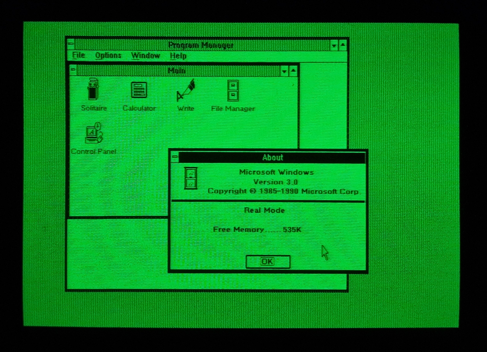
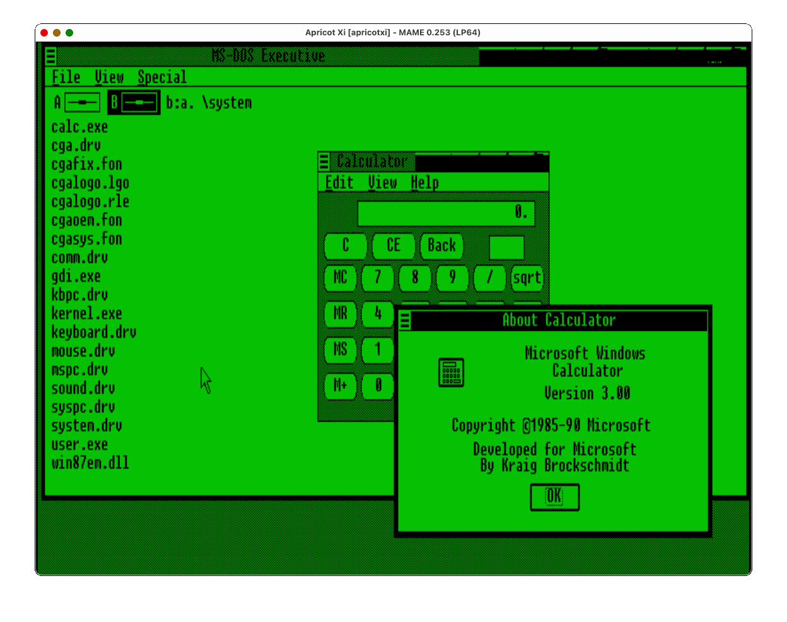
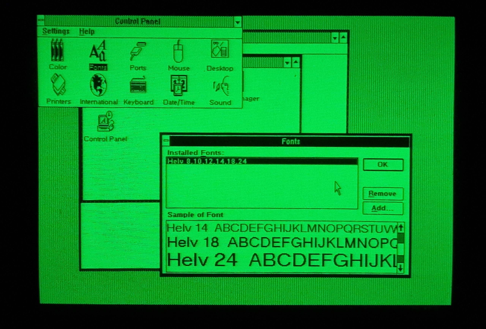
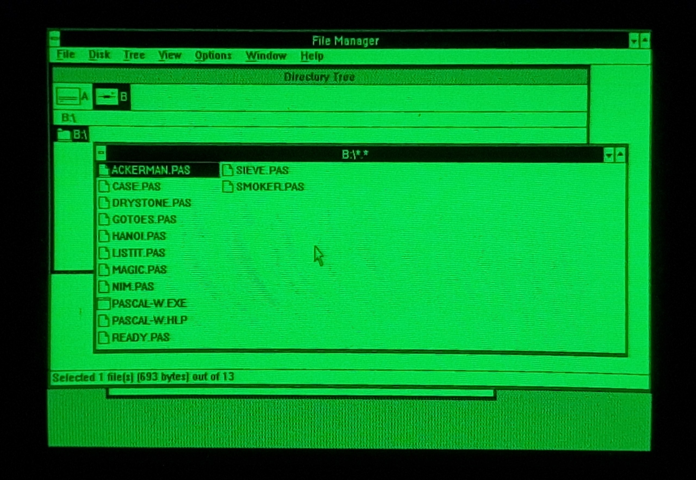
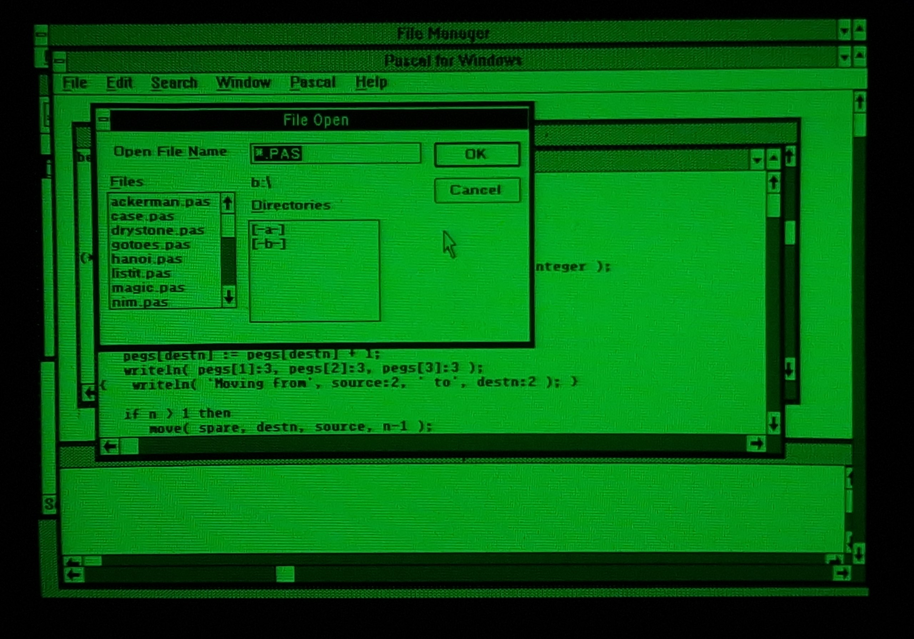
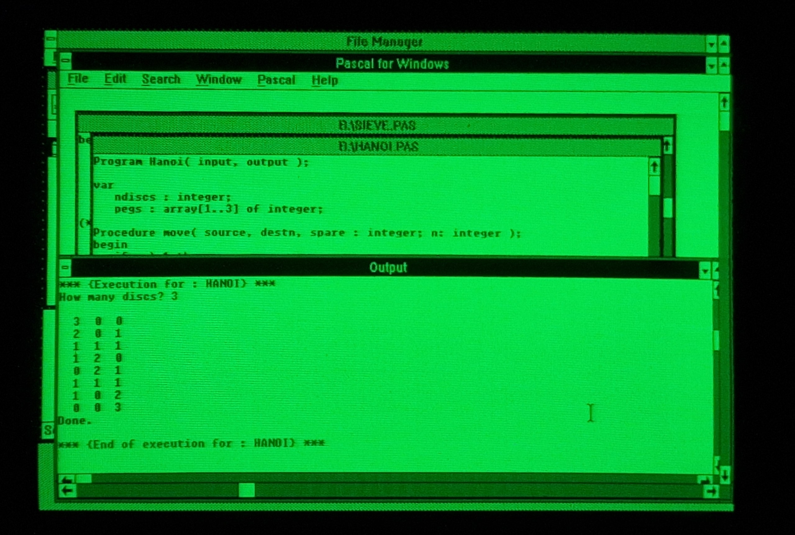
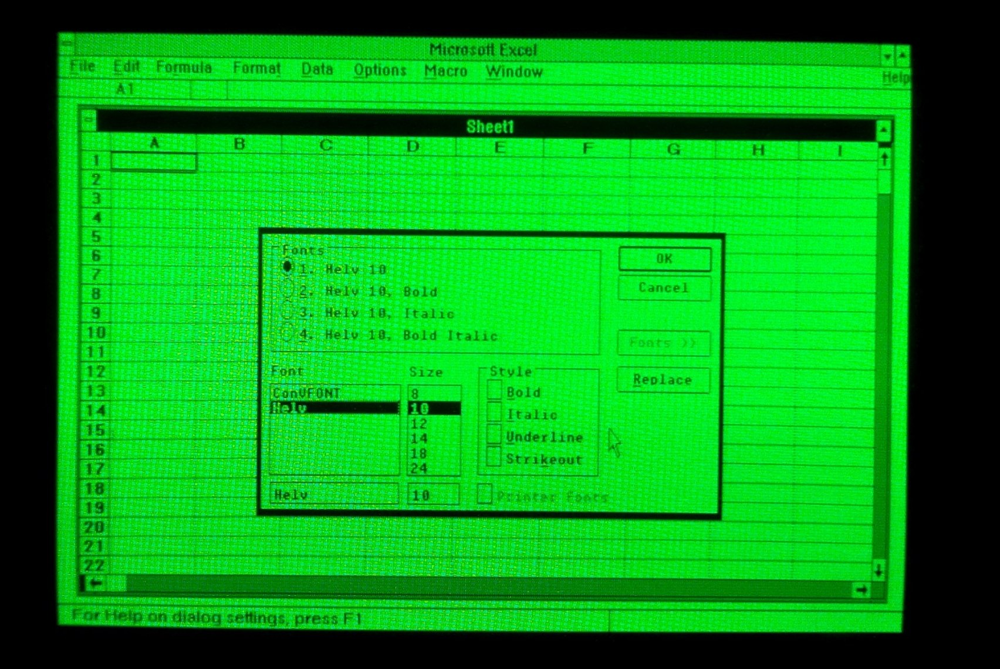
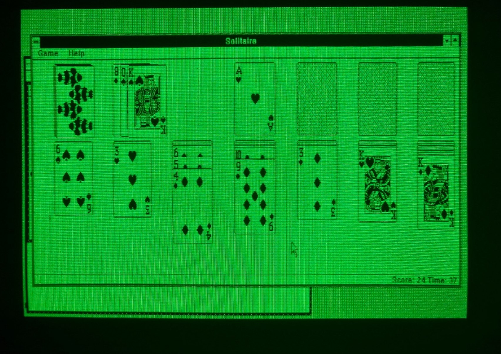
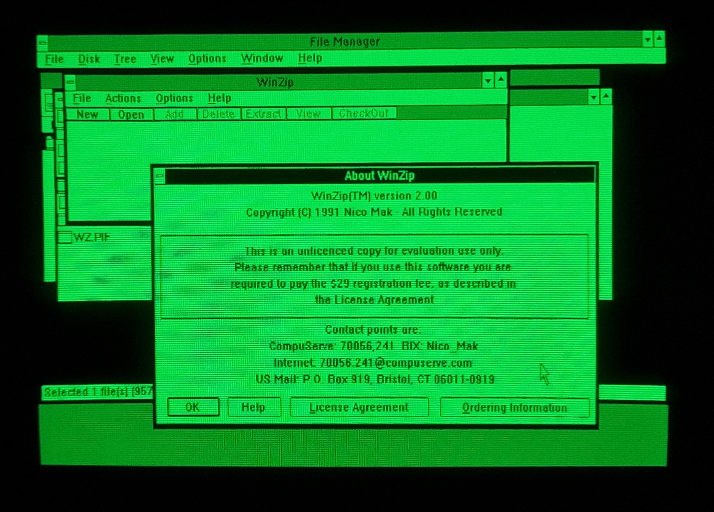
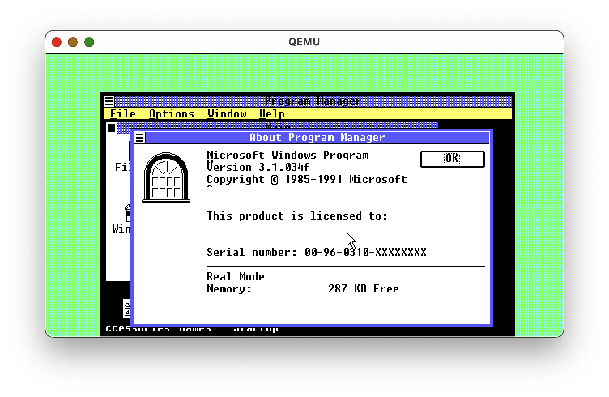

# Windows 2 & Windows 3 for the Apricot PC/Xi

(and Word, and Excel, and so much more) by Nina Kalinina, December 27th, 2025 (rev. 3.00 2026-01-04)

I bought my first Apricot PC about three years ago, when I realised I wanted an 8086-based computer. At the time, I knew nothing about it and simply bought it because it looked rad and the price was low. I had no idea that it was not IBM PC-compatible, and that there were very few programs available for it. 

I have been on a quest to get a modern-ish word processor and spreadsheet program for it ever since. Which eventually made me "port" Windows 2 on it. In this post, I will tell you the story of this port.

As a side-quest, I also wrote an [article explaining why Windows 2 is kind of awesome](https://ninakalinina.com/notes/win2/). Make sure to check it out, too, if you need more Windows 2 screenshots in your life. 

A photograph of a dark grey computer with a CRT monitor - an Apricot PC - running Windows 2

**Edit (January 4th, 2026):** A common feedback for the post was "Can you do Windows 3?" It took one more week to have a Windows 3.0 port working. The article has been expanded accordingly.

A screenshot of Windows 3.0 running on the Apricot PC/Xi

Please note that most of the images in this post were taken from a real green CRT, and thus their quality might vary. You can click the image to load it in full size.

If you have comments or feedback, please leave them in <a href="https://tech.lgbt/@nina_kali_nina/115792788459542758">the Mastodon thread</a>.

If you own an Apricot PC, or want to try the port in an emulator, check out [the project on sr.ht](https://git.sr.ht/~nkali/win2-apricot). You need an Apricot PC, PC/Xi or Xen with at least 512 kB of RAM.

 

If you find technical details boring the heck out of you, please don't hesitate to <b>scroll down to the screenshot section</b>.

## A few words about the Apricot PC/Xi

If you want a personal computer today, your general choice is between a "PC" and a "Mac". Back in the 1980s, you would have to choose between dozens or even hundreds of computer architectures, and "PC" was not necessarily the most popular choice for a computer. One of the most promising market contenders, Victor 9000, also known as Sirius 1, was released in 1981. It gained popularity in Europe, creating a niche market for "Sirius-compatible" computers. Two years later, the British company ACT released its Sirius-compatible Apricot PC.

A photograph of the main board of Apricot PC/Xi, in the process of being washed.

Apricot PC is a delightful computer with a great design. Its heart is Intel 8086, the older sibling of the 8088 used in the IBM PC. It uses lovely 3.5" floppy disks; and it is the first Western computer to have a 3.5" drive - before Apple Macintosh. The screen is 9 inches, 800x400 pixels, with great image fidelity. The PC/Xi model comes with a 10 megabyte Winchester hard drive, British-made Rodime RO352, the first-ever 3.5" hard drive.

A photograph of the computer's display showing multiple images at once: photographs of computer chips, schematics, and oscilloscope charts.

The computer is simple enough to be understood by one person in its entirety (over the course of many months of studying). There are schematics, technical manuals, BIOS reference manuals, and example code available for it, too. Its CPU is supported by Microsoft C, Turbo Pascal, and Open Watcom. It even runs MS-DOS (2.0 to 3.20), though, of course, it cannot run any IBM PC programs.

The lack of IBM PC-compatibility proved to be fatal for the Apricot. The entirety of its software catalogue is less than 300 megabytes. There is only one [graphical game with a soundtrack](https://74ls373.itch.io/where-is-owl) for it, and it was made in 2025.

There were, of course, productivity applications for the Apricot, including Microsoft Word for DOS. But among those, only two word processors had a graphical interface: GEM Write and Microsoft Write for Windows 1. Neither were popular; [GEM drivers were lost and re-created by John Elliot in 2012 or so](https://www.seasip.info/Gem/drivers3.html). Windows 1 was thought to be lost.

Hypothetically, it should be possible to port a 16-bit Windows to this computer. It would require creating `SYSTEM.DRV`, `DISPLAY.DRV`, `KEYBOARD.DRV`, `MOUSE.DRV`, and ideally `COMM.DRV` drivers. But that would be a lot of work.

A screenshot of Windows 1 Notepad. I didn't have a Windows 1 Write screenshot at hand, but trust me, it looks almost the same.

This is where things get interesting. A port of Windows 1 for the Apricot PC (released by ACT in 1987, a year before Windows 2) was miraculously preserved and surfaced online not that long ago. By itself, Windows 1 is unremarkable, as it does not have much useful software. But its driver architecture is not too different from Windows 2, so I thought it might be just about possible to make Windows 2 for the Apricot. And if I could somehow boot Windows 2, I'd be able to run Word, Excel, and Adobe Illustrator on my Apricot.

Well, it only took two and a half years to pull it off!

## Porting Windows 2 on the Apricot

### Booting, fast and slow
Even today, software historians are still arguing whether Windows 2.0 deserves to be called a major Windows update. It added dozens of new kernel features, but it barely changed the driver architecture of the system. The mouse and the keyboard drivers for Windows 2 would work fine on Windows 1, and vice versa. The CGA and EGA video drivers from Windows 1 would allow Windows 2 to boot, but could not render the fonts correctly. 

A screenshot of Windows 2 for IBM PC with a broken video driver; all text on the screen is garbled.

A natural thing to try would be installing Windows 2 with the Apricot drivers for Windows 1. Except that there are no _driver files_.

When you install Windows 1 or 2 on your computer, the SETUP utility combines (links) the driver files with the kernel. It is called "fast boot" and is supposed to improve the boot times of the system. The result of the SETUP is two files, WIN100.BIN and WIN100.OVL. The BIN file is an EXE file in disguise, consisting of the Windows kernel and the system drivers. The OVL file has resources and code that the system uses only from time to time.

The Windows 1 port of Apricot was only ever distributed with the "fast boot". The individual driver files were not distributed, so we cannot use them.

### The stub drivers
If there are no drivers, we can make some! Microsoft has a Driver Development Kit for Windows, also known as Windows DDK. The DDK comes with the drivers for the IBM PC, meant to be used as a reference for other platforms. With the help of the DDK, I implemented a [stub video driver](https://git.sr.ht/~nkali/win2-apricot/commit/51fcc80c4c26867ef7f153618ee4c0970dd735f0#win2stub_dd), and somehow got a stub mouse and system drivers. This was enough to confirm that Windows 2, indeed, can start on the Apricot PC without any patches to the kernel. I had my doubts about that, because Windows 2 comes with EMS memory support, and it might have been using something IBM PC-specific to test for it. Thankfully not.

A screenshot of Windows 2 booting in the text mode. The file manager application simply dumps the list of files on the screen, without drawing any windows.

### Trying to write a video driver
Now I could expand the drivers to support the Apricot PC. Keyboard, mouse, and even system drivers are small and simple. The real beast of a driver is DISPLAY.DRV, as it has to implement a large subset of the Windows graphical subsystem. With the reference display drivers, this should not be a problem, as long as the video card supports a graphical mode.

But the Apricot PC doesn't have a real graphical mode. It has a 50x25 "graphics screen" with a fake 16x16 font. This is a big problem.

A page of the Apricot technical reference explaining the organisation of the Video RAM.

The reference video driver from Microsoft makes many bold assumptions about the way video RAM is organised. With the display initialisation routines corrected, the image produced by the reference driver is still undecipherable.

A screenshot of the MAME emulator, running Windows 2 on the Apricot. There are no windows, only stripes of black.

Writing a driver for such a video card is significantly more painful than designing a VGA-compatible video card for the Apricot. Maybe I return to [the Apricot display driver project](https://git.sr.ht/~nkali/win2-apricot/tree/main/item/Apricot) one day (for the Windows 3.0 port), but for now, I have given up on it.

### Lose the battle, win the war: re-linking

Originally, I entertained the idea of unlinking the drivers from the WIN100.BIN/OVL files and reusing them, but rejected it. Not only is it difficult to do, but it is also useless, because the Windows 1 video driver would not display the fonts on the screen under Windows 2.

But when I hit the roadblock with writing the driver from scratch, I got an idea: what if I use a driver from Windows 1 _with fonts from Windows 1_? Apparently, this trick works!  And so, I decided to abandon the video driver writing if I could somehow extract a video driver from the WIN100.BIN/OVL, because I would not need to reverse-engineer it to patch in the font support; it could work out of the box. But how?

The driver files in WIN100 are not "simply concatenated together": some parts from DISPLAY.DRV ends up in WIN100.BIN, and some in WIN100.OVL. Looking closely at those parts, I realised that the part in WIN100.OVL is identical to the Hercules driver. This gave me an idea: I could get a Hercules video driver; then I could extract CODE and DATA segments along with the Entry Table from the WIN100.BIN, and patch them into the Hercules driver. Unfortunately, not a single NE file format tool supported this use-case. I ended up writing [my own tool NExus-relink](https://git.sr.ht/~nkali/nexus-relink) to assist in this process; the tool is still incomplete, but it gave me enough leverage to finish the job manually.

For the video driver, I used a "combine" tool I made for NExus, and then manually patched in the offsets and lengths in the NE header (one for the entry table, two for the segments). Incredibly, this was enough to make Windows 2 happy about the display: 

A screenshot of Windows 2 running in the MAME emulator.

The same trick worked for the keyboard driver, but the mouse driver gave me a headache. I knew that when the mouse is not found, Windows doesn't display it on the screen, so I kept iterating on the driver, going deeper and deeper. The mouse driver has a relocation table of the OS Fixup type, and there are very few things written about it, so I wasn't sure if the driver was loading correctly.

I confirmed that the interrupt handler of the driver works, and was about to check the kernel source of the corresponding event handler when I discovered that, in fact, the mouse was working fine. It's just that the cursor wasn't displayed on the screen.

In Windows 1/2, the cursor is handled by the video driver to allow hardware acceleration and "hide cursor before taking a screenshot or drawing a bitmap". So, why is the video driver not drawing the cursor?

Windows DDK documentation has an answer: the mouse cursor drawing routines in the video driver are called by a timer routine, from the SYSTEM.DRV. I told about this to my fiancée, Atsuko, and she said: "Oh, you didn't notice the cursor wasn't blinking?"

Turns out, the timer routines in the SYSTEM.DRV were broken. The SYSTEM.DRV from Windows 1.0 cannot be used with Windows 2, so I implemented [the Apricot PC `SYSTEM.DRV`](https://git.sr.ht/~nkali/win2-apricot/tree/main/item/System/SOURCE) using Windows DDK as a reference.

With this driver complete, I had Windows 2 working on my Apricot PC/Xi.

# Windows 2 for the Apricot PC: a tour

Welcome, welcome, let me show you around!

I am greeted with the AUG logo when I power up my Apricot. I use the AUG BIOS because it supports the upgraded CPU, NEC V30, much better than the original one. Note that my machine has 896 kB of RAM.

The PC/Xi comes with a single 720 kB floppy drive and a 10 MB hard drive. I have MS-DOS 3.20 installed on the hard drive.

I have created a file called `win.bat` that simply starts the kernel.

Welcome to Windows 2. I have GW Basic, Turbo Pascal, Windows 1, Windows 2, Word and Excel installed on the hard drive, and I still have almost 2 megabytes free.

PC Paintbrush is one of the few programs that work on both Windows 1 and Windows 2. But it is more stable when running on top of Windows 2. Note that this is not Microsoft Paint **yet**: Microsoft would license this product only for its Windows 3.0 release.

I have to remind you that the screen is <em>monochrome</em>. Pixel dithering works really well on a 100 PPI 800x400 display, creating shades of grey from pixel patterns.

The screen is 4:3, so the pixels are not square. I have to pre-process raster images so they would look right on the Apricot's screen. Vector images are fine, though.

The default shell for Windows 2 is a bit too minimalistic to my taste. WANG's ClearView for Windows 2 brings a familiar to Windows 3 users PROGMAN-like experience to the Apricot.

Windows 1 came with tiling windows; Windows 2 uses overlapping windows that quickly become a disorganised mess. ClearView's window manager can arrange the windows for you.

Windows 2 control panel looks a bit funny in monochrome, but it is a powerful reminder that Windows supports 24-bit colour, which is important for printing and publishing.

A side note: Apricot's keyboard had an LED in the logo before ThinkPad did.

The MicroScreen and re-programmable keys are fully supported by the Windows keyboard driver. There is no ALT key, so "Close" is as close as we can get to pressing ALT+f4. Note that there is a hotkey for starting the XENTEL telephone accessory. The XENTEL button is somewhat similar to a Copilot button, except it can actually be useful in some situations.

Microsoft Word for Windows. Word for DOS, a completely different program, was first released back in 1983. Word for Windows had its first release in late 1989 due to a non-competition agreement with Apple. The success of Word for Windows made Microsoft abandon Word for DOS and Word for Mac; all the new versions of Word were based on <em>this</em> Word.

Word for Windows is surprisingly powerful for a brand-new product. There is a spellchecker, a page layout editor, and even support for macros. I have deleted the macros to save space on the hard drive, so the README file shows "Error!" where the macros were. The files created by Word for Windows 1.0 can be opened by modern office suites if you save as RTF.

Microsoft Excel is a real must-have. There is no other spreadsheet as powerful as Excel on the Apricot.

Excel for Windows from 1988 looks almost exactly like Excel for Windows from 2018.

My previous trip to Japan was planned between Google Docs and Excel for Windows 2 (I had to convert the file back and forth). I needed a few GB of RAM for Google Docs, and only a few hundred kilobytes for Excel.

Excel Help is a hidden gem. It is a hypertext application that feels a lot like a web browser.

I used the Help application to see how to create a stonks chart.

Creating a stonks chart is surprisingly easy. There are 44 chart types, more than many modern programs offer.

Until yesterday, Apricot PC had five graphical games: Chess, Where Is The Owl, Windows 1 Reversi, Windows 1 Minesweeper, and Windows 1 Risk. Now there are many more, including a solitaire and a Taipei mahjongg.

That's it! There are many Windows 2 programs I have yet to try on the Apricot, but my quest for running modern-ish Word and Excel for Windows is finally over.

# Windows 3 on the Apricot PC?!

Lots of people have asked me whether it's possible to run Windows 3 on the Apricot. I used to think that it is technically possible, but would require too much work. However, I recently learned that Windows 2 display drivers work in Windows 3.0 Real Mode. And they really do!

Now the question: would drivers from Windows 1 work in Windows 3.0 RM? The answer is "kind of". The system crashes if we use the `{CGA,EGA,VGA}SYS.FON` from Windows 2 or 3, but it actually boots with `FONTS.FON` from Windows 1.

Apricot PC emulatd by MAME. The screen shows Windows 3.0 Calculator with its "About" Window in front of the MS-DOS Executive window. The buttons in the upper right corner of windows are glitching.

As you can see, the video driver is missing resources for the window decorations. And you cannot see, but the keyboard driver is completely broken. As it happens, Windows 2.0 keyboard drivers are not compatible with Windows 3.0, and so we had to write one from scratch, using Windows 3.0 DDK. Patching the display driver to add the missing UI elements was a piece of cake compared to it.

## Screenshots

Windows 3 looks surprisingly friendly on the Apricot's monochrome display.

The new control panel is mostly working without issues. I also figured out how to fix the scalable fonts.

File Manager for Windows 3 is one of the best additions brought by the upgrade. It even supports drag and drop for files.

Windows 3 doesn't have COMMCTRL.DLL with "Open" and "Save" dialogs yet, but some programs bring their own, and some try to replicate it.

There is a lot of hype around Windows 3, but there aren't that many new programs that Real Mode Windows 3 can run and Windows 2 can not. Pascal for Windows is one of such programs.

Excel for Windows still works, but Word for Windows crashes (it doesn't like something about the display driver). It can use fonts now.

Microsoft Windows Solitaire looks much nicer than WinSolitaire for Windows 2.

Internet Explorer, Windows Media Player, NCSA Mosaic... All of them require a processor that supports protected mode. And in the time of need, only WinZip has your back.

## Windows 3.1?!

As you might know, Windows 3.1 dropped support for Intel 8086 and 8088. An early beta, Windows 3.1.034e (!), can run in the Real Mode using Windows 1.0 video drivers, but it is really unstable. It looks "funny" with the Windows 1 UI elements, though.

)

This is Windows 3.1, but it looks a lot like Windows 1.0 because a large part of the interface comes from the resources in the display driver.

So, this is as far as we get, in case of the Apricot PC/Xi. 

But a friend of mine has an Apricot Xen, which is a very similar machine with an Intel 286 processor, and it should be able to run Windows 3.1 in the "Standard" (protected) mode. Maybe I'll be able to get the Internet Explorer running on it.

## Acknowledgments
* Thank you for reading! If you have any questions or comments, please let me know. You can leave a comment in the [Mastodon thread about this article](https://tech.lgbt/@nina_kali_nina/115792788459542758).
* My fiancée not only helped with beta-testing, she even designed a RAM expansion board for the Apricot PC/Xi that was necessary to run Windows on it. And then wrote the keyboard driver for Windows 3. Love~
* This project could not exist without advice from Michal Necasek of [os2museum](https://www.os2museum.com/wp/author/michaln/) and David Simunič of [krnl386](https://win1.krnl386.com/about.php) regarding drivers for ancient Windows version.

